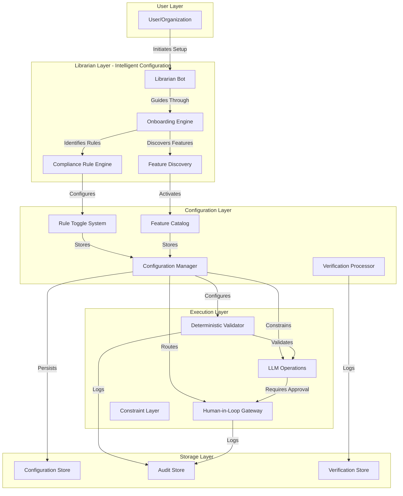
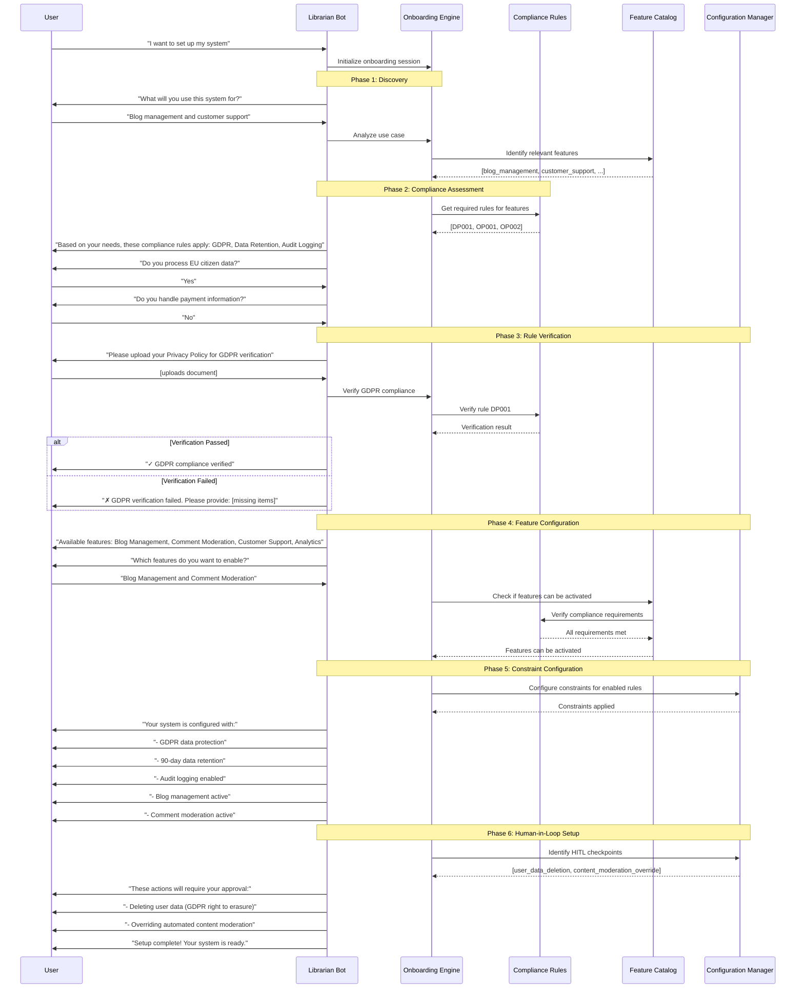
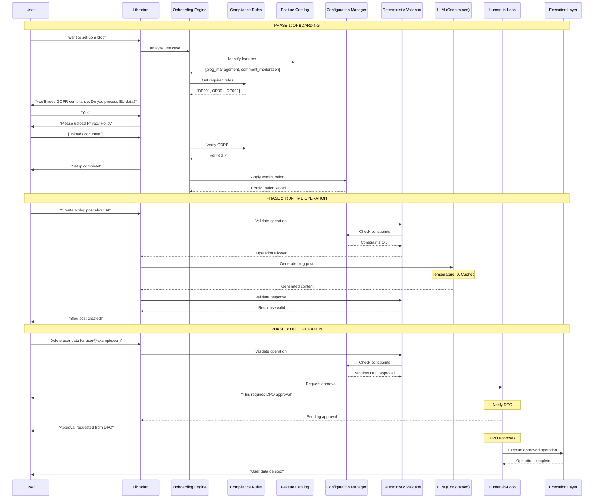

# Flexible Compliance & Configuration System Architecture
## Murphy AI Platform - Modular, Scalable, Verifiable

---

## 🎯 EXECUTIVE SUMMARY

This document presents a comprehensive architecture for a flexible, modular compliance and configuration system that transforms the Murphy AI platform from MVP to production-ready product. The system uses a **Librarian-guided onboarding** approach with **toggle-based compliance rules**, **deterministic validation layers**, and **adaptive feature activation** to support use cases ranging from simple blog management to full organizational automation.

**Key Innovation**: The system acts as a "compliance-aware building block platform" where users select only what they need, and the system automatically configures constraints, validations, and human-in-the-loop checkpoints based on their selections.

---

## 1. SYSTEM ARCHITECTURE OVERVIEW

### 1.1 Core Components



### 1.2 Design Principles

1. **Modularity**: Every feature is a self-contained module that can be enabled/disabled
2. **Compliance-First**: Compliance rules are evaluated before feature activation
3. **Verifiability**: Every configuration decision is logged and auditable
4. **Determinism**: Post-configuration operations follow strict, repeatable rules
5. **Adaptability**: System scales from minimal (blog) to maximal (full org) configurations
6. **Safety**: Human-in-the-loop for high-risk operations

---

## 2. COMPLIANCE RULE TOGGLE SYSTEM

### 2.1 Rule Structure

Each compliance rule is a self-contained, toggleable unit:

```python
from enum import Enum
from dataclasses import dataclass
from typing import List, Optional, Callable

class ComplianceCategory(Enum):
    DATA_PRIVACY = "data_privacy"
    FINANCIAL = "financial"
    HEALTHCARE = "healthcare"
    SECURITY = "security"
    INDUSTRY_SPECIFIC = "industry_specific"
    OPERATIONAL = "operational"

class RuleSeverity(Enum):
    CRITICAL = "critical"      # Must be verified before any operation
    HIGH = "high"              # Must be verified before feature activation
    MEDIUM = "medium"          # Should be verified, can proceed with warning
    LOW = "low"                # Optional, informational only

class VerificationMethod(Enum):
    DOCUMENT_UPLOAD = "document_upload"
    API_INTEGRATION = "api_integration"
    MANUAL_REVIEW = "manual_review"
    AUTOMATED_CHECK = "automated_check"
    THIRD_PARTY_VERIFICATION = "third_party_verification"

@dataclass
class ComplianceRule:
    """
    A single compliance rule that can be toggled on/off
    """
    id: str
    name: str
    description: str
    category: ComplianceCategory
    severity: RuleSeverity
    
    # Toggle state
    enabled: bool = False
    verified: bool = False
    
    # Verification requirements
    verification_method: VerificationMethod
    verification_criteria: dict
    verification_documents: List[str]
    
    # Constraints this rule imposes
    constraints: List[str]  # List of constraint IDs
    required_features: List[str]  # Features that require this rule
    blocked_features: List[str]  # Features blocked by this rule
    
    # Validation
    validator_function: Optional[Callable] = None
    
    # Metadata
    regulatory_reference: Optional[str] = None
    last_verified: Optional[str] = None
    verification_expiry: Optional[str] = None
    
    def verify(self, evidence: dict) -> bool:
        """
        Verify this rule against provided evidence
        """
        if self.validator_function:
            return self.validator_function(evidence, self.verification_criteria)
        return False
    
    def get_constraints(self) -> List['Constraint']:
        """
        Get all constraints imposed by this rule
        """
        from constraint_registry import get_constraints_by_ids
        return get_constraints_by_ids(self.constraints)
```

### 2.2 Baseline Compliance Rule Set

```python
# compliance_rules.py

BASELINE_COMPLIANCE_RULES = {
    # DATA PRIVACY RULES
    "DP001": ComplianceRule(
        id="DP001",
        name="GDPR Compliance",
        description="EU General Data Protection Regulation compliance for processing EU citizen data",
        category=ComplianceCategory.DATA_PRIVACY,
        severity=RuleSeverity.CRITICAL,
        verification_method=VerificationMethod.DOCUMENT_UPLOAD,
        verification_criteria={
            "required_documents": ["privacy_policy", "data_processing_agreement"],
            "required_features": ["data_deletion", "data_export", "consent_management"]
        },
        verification_documents=["Privacy Policy", "DPA", "GDPR Assessment"],
        constraints=["C001", "C002", "C003"],  # Data retention, encryption, consent
        required_features=["user_data_management", "consent_tracking"],
        blocked_features=["unrestricted_data_sharing"],
        regulatory_reference="GDPR Articles 5, 6, 7, 17, 20"
    ),
    
    "DP002": ComplianceRule(
        id="DP002",
        name="CCPA Compliance",
        description="California Consumer Privacy Act compliance",
        category=ComplianceCategory.DATA_PRIVACY,
        severity=RuleSeverity.HIGH,
        verification_method=VerificationMethod.DOCUMENT_UPLOAD,
        verification_criteria={
            "required_documents": ["privacy_notice", "opt_out_mechanism"],
            "california_operations": True
        },
        verification_documents=["Privacy Notice", "Opt-Out Process Documentation"],
        constraints=["C001", "C004"],  # Data retention, opt-out
        required_features=["data_sale_opt_out"],
        blocked_features=[],
        regulatory_reference="CCPA Section 1798.100-1798.199"
    ),
    
    # FINANCIAL RULES
    "FN001": ComplianceRule(
        id="FN001",
        name="PCI DSS Compliance",
        description="Payment Card Industry Data Security Standard for handling payment data",
        category=ComplianceCategory.FINANCIAL,
        severity=RuleSeverity.CRITICAL,
        verification_method=VerificationMethod.THIRD_PARTY_VERIFICATION,
        verification_criteria={
            "required_certification": "PCI DSS Level 1 or 2",
            "annual_audit": True
        },
        verification_documents=["PCI DSS Certificate", "QSA Audit Report"],
        constraints=["C010", "C011", "C012"],  # Encryption, access control, logging
        required_features=["payment_processing", "secure_storage"],
        blocked_features=["plain_text_card_storage"],
        regulatory_reference="PCI DSS v4.0"
    ),
    
    "FN002": ComplianceRule(
        id="FN002",
        name="SOX Compliance",
        description="Sarbanes-Oxley Act compliance for financial reporting",
        category=ComplianceCategory.FINANCIAL,
        severity=RuleSeverity.HIGH,
        verification_method=VerificationMethod.MANUAL_REVIEW,
        verification_criteria={
            "public_company": True,
            "financial_reporting": True
        },
        verification_documents=["SOX Controls Documentation", "Audit Trail Procedures"],
        constraints=["C013", "C014"],  # Audit trails, segregation of duties
        required_features=["audit_logging", "role_based_access"],
        blocked_features=["unrestricted_financial_access"],
        regulatory_reference="SOX Sections 302, 404, 409"
    ),
    
    # HEALTHCARE RULES
    "HC001": ComplianceRule(
        id="HC001",
        name="HIPAA Compliance",
        description="Health Insurance Portability and Accountability Act for PHI",
        category=ComplianceCategory.HEALTHCARE,
        severity=RuleSeverity.CRITICAL,
        verification_method=VerificationMethod.DOCUMENT_UPLOAD,
        verification_criteria={
            "handles_phi": True,
            "required_documents": ["baa", "security_risk_assessment"]
        },
        verification_documents=["Business Associate Agreement", "Security Risk Assessment", "HIPAA Policies"],
        constraints=["C020", "C021", "C022"],  # PHI encryption, access logs, breach notification
        required_features=["phi_encryption", "access_logging", "breach_notification"],
        blocked_features=["unencrypted_phi_storage", "unrestricted_phi_access"],
        regulatory_reference="HIPAA Privacy Rule, Security Rule, Breach Notification Rule"
    ),
    
    # SECURITY RULES
    "SC001": ComplianceRule(
        id="SC001",
        name="SOC 2 Type II",
        description="Service Organization Control 2 Type II certification",
        category=ComplianceCategory.SECURITY,
        severity=RuleSeverity.HIGH,
        verification_method=VerificationMethod.THIRD_PARTY_VERIFICATION,
        verification_criteria={
            "required_certification": "SOC 2 Type II",
            "annual_audit": True
        },
        verification_documents=["SOC 2 Type II Report"],
        constraints=["C030", "C031", "C032"],  # Security controls, monitoring, incident response
        required_features=["security_monitoring", "incident_response"],
        blocked_features=[],
        regulatory_reference="AICPA SOC 2 Trust Services Criteria"
    ),
    
    "SC002": ComplianceRule(
        id="SC002",
        name="ISO 27001",
        description="Information Security Management System certification",
        category=ComplianceCategory.SECURITY,
        severity=RuleSeverity.MEDIUM,
        verification_method=VerificationMethod.THIRD_PARTY_VERIFICATION,
        verification_criteria={
            "required_certification": "ISO 27001",
            "isms_implemented": True
        },
        verification_documents=["ISO 27001 Certificate"],
        constraints=["C033", "C034"],  # ISMS controls, risk management
        required_features=["risk_management", "security_controls"],
        blocked_features=[],
        regulatory_reference="ISO/IEC 27001:2013"
    ),
    
    # INDUSTRY-SPECIFIC RULES
    "IS001": ComplianceRule(
        id="IS001",
        name="FERPA Compliance",
        description="Family Educational Rights and Privacy Act for educational records",
        category=ComplianceCategory.INDUSTRY_SPECIFIC,
        severity=RuleSeverity.HIGH,
        verification_method=VerificationMethod.DOCUMENT_UPLOAD,
        verification_criteria={
            "educational_institution": True,
            "handles_student_records": True
        },
        verification_documents=["FERPA Policies", "Data Sharing Agreements"],
        constraints=["C040", "C041"],  # Student data protection, parental access
        required_features=["student_data_protection", "parental_access_controls"],
        blocked_features=["unrestricted_student_data_sharing"],
        regulatory_reference="FERPA 20 U.S.C. § 1232g"
    ),
    
    # OPERATIONAL RULES
    "OP001": ComplianceRule(
        id="OP001",
        name="Data Retention Policy",
        description="Standard data retention and deletion policies",
        category=ComplianceCategory.OPERATIONAL,
        severity=RuleSeverity.MEDIUM,
        verification_method=VerificationMethod.AUTOMATED_CHECK,
        verification_criteria={
            "retention_policy_defined": True,
            "automated_deletion": True
        },
        verification_documents=["Data Retention Policy"],
        constraints=["C050"],  # Automated data deletion
        required_features=["automated_data_deletion"],
        blocked_features=[],
        regulatory_reference="Industry best practices"
    ),
    
    "OP002": ComplianceRule(
        id="OP002",
        name="Audit Logging",
        description="Comprehensive audit logging for all system operations",
        category=ComplianceCategory.OPERATIONAL,
        severity=RuleSeverity.HIGH,
        verification_method=VerificationMethod.AUTOMATED_CHECK,
        verification_criteria={
            "audit_logging_enabled": True,
            "log_retention_days": 90
        },
        verification_documents=[],
        constraints=["C051"],  # Audit logging
        required_features=["audit_logging"],
        blocked_features=[],
        regulatory_reference="Industry best practices"
    ),
}
```

### 2.3 Rule Toggle Management

```python
# rule_toggle_manager.py

class RuleToggleManager:
    """
    Manages the state of compliance rules for a specific user/organization
    """
    
    def __init__(self, organization_id: str):
        self.organization_id = organization_id
        self.rules = {}
        self.load_rules()
    
    def load_rules(self):
        """Load rules from baseline and organization-specific overrides"""
        # Start with baseline
        self.rules = BASELINE_COMPLIANCE_RULES.copy()
        
        # Load organization-specific overrides
        org_rules = self._load_org_rules(self.organization_id)
        self.rules.update(org_rules)
    
    def enable_rule(self, rule_id: str, reason: str) -> bool:
        """
        Enable a compliance rule
        """
        if rule_id not in self.rules:
            raise ValueError(f"Rule {rule_id} not found")
        
        rule = self.rules[rule_id]
        rule.enabled = True
        
        # Log the change
        self._log_rule_change(rule_id, "enabled", reason)
        
        # Apply constraints
        self._apply_constraints(rule)
        
        return True
    
    def disable_rule(self, rule_id: str, reason: str, override_approval: bool = False) -> bool:
        """
        Disable a compliance rule (requires approval for CRITICAL rules)
        """
        if rule_id not in self.rules:
            raise ValueError(f"Rule {rule_id} not found")
        
        rule = self.rules[rule_id]
        
        # CRITICAL rules require explicit override approval
        if rule.severity == RuleSeverity.CRITICAL and not override_approval:
            raise PermissionError(f"Cannot disable CRITICAL rule {rule_id} without override approval")
        
        rule.enabled = False
        rule.verified = False
        
        # Log the change
        self._log_rule_change(rule_id, "disabled", reason)
        
        # Remove constraints
        self._remove_constraints(rule)
        
        return True
    
    def verify_rule(self, rule_id: str, evidence: dict) -> bool:
        """
        Verify a rule against provided evidence
        """
        if rule_id not in self.rules:
            raise ValueError(f"Rule {rule_id} not found")
        
        rule = self.rules[rule_id]
        
        if not rule.enabled:
            raise ValueError(f"Rule {rule_id} is not enabled")
        
        # Run verification
        verified = rule.verify(evidence)
        
        if verified:
            rule.verified = True
            rule.last_verified = datetime.now().isoformat()
            
            # Set expiry if applicable
            if "verification_validity_days" in evidence:
                expiry = datetime.now() + timedelta(days=evidence["verification_validity_days"])
                rule.verification_expiry = expiry.isoformat()
        
        # Log verification attempt
        self._log_verification(rule_id, verified, evidence)
        
        return verified
    
    def get_enabled_rules(self) -> List[ComplianceRule]:
        """Get all enabled rules"""
        return [rule for rule in self.rules.values() if rule.enabled]
    
    def get_unverified_rules(self) -> List[ComplianceRule]:
        """Get all enabled but unverified rules"""
        return [rule for rule in self.rules.values() if rule.enabled and not rule.verified]
    
    def get_expired_rules(self) -> List[ComplianceRule]:
        """Get all rules with expired verification"""
        now = datetime.now()
        expired = []
        for rule in self.rules.values():
            if rule.enabled and rule.verification_expiry:
                expiry = datetime.fromisoformat(rule.verification_expiry)
                if expiry < now:
                    expired.append(rule)
        return expired
    
    def get_required_rules_for_features(self, feature_ids: List[str]) -> List[ComplianceRule]:
        """
        Get all rules required for a set of features
        """
        required_rules = []
        for rule in self.rules.values():
            if any(feature in rule.required_features for feature in feature_ids):
                required_rules.append(rule)
        return required_rules
    
    def get_blocked_features(self) -> List[str]:
        """
        Get all features blocked by enabled rules
        """
        blocked = set()
        for rule in self.get_enabled_rules():
            blocked.update(rule.blocked_features)
        return list(blocked)
    
    def can_activate_feature(self, feature_id: str) -> tuple[bool, List[str]]:
        """
        Check if a feature can be activated
        Returns (can_activate, reasons)
        """
        # Check if blocked
        if feature_id in self.get_blocked_features():
            blocking_rules = [
                rule.id for rule in self.get_enabled_rules()
                if feature_id in rule.blocked_features
            ]
            return False, [f"Blocked by rules: {', '.join(blocking_rules)}"]
        
        # Check if required rules are verified
        required_rules = self.get_required_rules_for_features([feature_id])
        unverified = [rule for rule in required_rules if not rule.verified]
        
        if unverified:
            return False, [f"Required rules not verified: {', '.join([r.id for r in unverified])}"]
        
        return True, []
    
    def _apply_constraints(self, rule: ComplianceRule):
        """Apply constraints from a rule"""
        from constraint_manager import ConstraintManager
        cm = ConstraintManager(self.organization_id)
        for constraint_id in rule.constraints:
            cm.enable_constraint(constraint_id, f"Required by rule {rule.id}")
    
    def _remove_constraints(self, rule: ComplianceRule):
        """Remove constraints from a rule"""
        from constraint_manager import ConstraintManager
        cm = ConstraintManager(self.organization_id)
        for constraint_id in rule.constraints:
            cm.disable_constraint(constraint_id, f"Rule {rule.id} disabled")
    
    def _log_rule_change(self, rule_id: str, action: str, reason: str):
        """Log rule state changes"""
        log_entry = {
            "timestamp": datetime.now().isoformat(),
            "organization_id": self.organization_id,
            "rule_id": rule_id,
            "action": action,
            "reason": reason
        }
        # Store in audit log
        audit_store.log("rule_change", log_entry)
    
    def _log_verification(self, rule_id: str, verified: bool, evidence: dict):
        """Log verification attempts"""
        log_entry = {
            "timestamp": datetime.now().isoformat(),
            "organization_id": self.organization_id,
            "rule_id": rule_id,
            "verified": verified,
            "evidence_summary": {k: v for k, v in evidence.items() if k != "sensitive_data"}
        }
        # Store in verification log
        verification_store.log("verification_attempt", log_entry)
```

---

## 3. LIBRARIAN-GUIDED ONBOARDING SYSTEM

### 3.1 Onboarding Flow



### 3.2 Librarian Onboarding Engine

```python
# librarian_onboarding.py

class LibrarianOnboardingEngine:
    """
    Intelligent onboarding engine that guides users through setup
    """
    
    def __init__(self, organization_id: str):
        self.organization_id = organization_id
        self.session = OnboardingSession(organization_id)
        self.rule_manager = RuleToggleManager(organization_id)
        self.feature_catalog = FeatureCatalog()
        self.llm_client = LLMClient()
    
    async def start_onboarding(self, user_input: str) -> dict:
        """
        Start the onboarding process
        """
        # Phase 1: Discover use case
        use_case = await self._discover_use_case(user_input)
        self.session.use_case = use_case
        
        # Phase 2: Identify relevant features
        features = await self._identify_features(use_case)
        self.session.suggested_features = features
        
        # Phase 3: Determine compliance requirements
        rules = await self._determine_compliance_rules(features)
        self.session.required_rules = rules
        
        # Phase 4: Generate onboarding questions
        questions = await self._generate_questions(use_case, features, rules)
        self.session.questions = questions
        
        return {
            "session_id": self.session.id,
            "use_case": use_case,
            "suggested_features": features,
            "required_rules": rules,
            "next_question": questions[0] if questions else None
        }
    
    async def _discover_use_case(self, user_input: str) -> dict:
        """
        Use LLM to understand user's use case
        """
        prompt = f"""
        Analyze this user's intended use case and categorize it:
        
        User input: "{user_input}"
        
        Identify:
        1. Primary purpose (blog, e-commerce, organization management, etc.)
        2. Scale (individual, small team, enterprise)
        3. Industry (if applicable)
        4. Key requirements
        5. Potential compliance needs
        
        Return as JSON.
        """
        
        response = await self.llm_client.generate(prompt, temperature=0)
        use_case = json.loads(response)
        
        return use_case
    
    async def _identify_features(self, use_case: dict) -> List[str]:
        """
        Identify relevant features based on use case
        """
        # Use rule-based matching for common cases
        feature_map = {
            "blog": ["blog_management", "content_creation", "comment_moderation", "seo_tools"],
            "e-commerce": ["product_catalog", "shopping_cart", "payment_processing", "order_management"],
            "organization": ["user_management", "role_based_access", "workflow_automation", "reporting"],
            "customer_support": ["ticket_management", "knowledge_base", "chat_support", "email_integration"]
        }
        
        primary_purpose = use_case.get("primary_purpose", "").lower()
        features = []
        
        # Get features from map
        for key, feature_list in feature_map.items():
            if key in primary_purpose:
                features.extend(feature_list)
        
        # Use LLM for complex cases
        if not features or use_case.get("scale") == "enterprise":
            prompt = f"""
            Based on this use case, recommend specific features:
            {json.dumps(use_case, indent=2)}
            
            Available features: {json.dumps(self.feature_catalog.get_all_feature_ids())}
            
            Return list of feature IDs as JSON array.
            """
            response = await self.llm_client.generate(prompt, temperature=0)
            llm_features = json.loads(response)
            features.extend(llm_features)
        
        # Remove duplicates
        return list(set(features))
    
    async def _determine_compliance_rules(self, features: List[str]) -> List[str]:
        """
        Determine which compliance rules are required for selected features
        """
        required_rules = set()
        
        for feature_id in features:
            feature = self.feature_catalog.get_feature(feature_id)
            if feature:
                required_rules.update(feature.required_compliance_rules)
        
        return list(required_rules)
    
    async def _generate_questions(self, use_case: dict, features: List[str], rules: List[str]) -> List[dict]:
        """
        Generate onboarding questions
        """
        questions = []
        
        # Questions about compliance rules
        for rule_id in rules:
            rule = self.rule_manager.rules.get(rule_id)
            if rule:
                questions.append({
                    "type": "compliance_verification",
                    "rule_id": rule_id,
                    "question": self._generate_rule_question(rule),
                    "required_documents": rule.verification_documents,
                    "severity": rule.severity.value
                })
        
        # Questions about feature preferences
        questions.append({
            "type": "feature_selection",
            "question": f"We've identified these features for your use case: {', '.join(features)}. Which would you like to enable?",
            "options": features,
            "allow_multiple": True
        })
        
        # Questions about data handling
        if any("data" in f for f in features):
            questions.append({
                "type": "data_handling",
                "question": "What types of data will you be processing?",
                "options": ["Personal data (names, emails)", "Financial data", "Health data", "Other sensitive data", "None of the above"],
                "allow_multiple": True
            })
        
        return questions
    
    def _generate_rule_question(self, rule: ComplianceRule) -> str:
        """
        Generate a question for a compliance rule
        """
        templates = {
            ComplianceCategory.DATA_PRIVACY: "Will you be processing {data_type}?",
            ComplianceCategory.FINANCIAL: "Will you be handling {transaction_type}?",
            ComplianceCategory.HEALTHCARE: "Will you be storing or processing {health_data_type}?",
            ComplianceCategory.SECURITY: "Do you require {security_level} security certification?",
        }
        
        template = templates.get(rule.category, "Does {rule_name} apply to your use case?")
        
        # Customize based on rule
        if rule.id == "DP001":  # GDPR
            return "Will you be processing data of EU citizens?"
        elif rule.id == "FN001":  # PCI DSS
            return "Will you be processing credit card payments?"
        elif rule.id == "HC001":  # HIPAA
            return "Will you be handling protected health information (PHI)?"
        else:
            return template.format(rule_name=rule.name)
    
    async def process_answer(self, session_id: str, question_id: str, answer: dict) -> dict:
        """
        Process user's answer to a question
        """
        session = self._load_session(session_id)
        question = next((q for q in session.questions if q.get("id") == question_id), None)
        
        if not question:
            raise ValueError(f"Question {question_id} not found")
        
        # Store answer
        session.answers[question_id] = answer
        
        # Process based on question type
        if question["type"] == "compliance_verification":
            result = await self._process_compliance_answer(question, answer)
        elif question["type"] == "feature_selection":
            result = await self._process_feature_selection(question, answer)
        elif question["type"] == "data_handling":
            result = await self._process_data_handling(question, answer)
        else:
            result = {"status": "processed"}
        
        # Get next question
        next_question = self._get_next_question(session)
        
        return {
            "result": result,
            "next_question": next_question,
            "progress": self._calculate_progress(session)
        }
    
    async def _process_compliance_answer(self, question: dict, answer: dict) -> dict:
        """
        Process compliance verification answer
        """
        rule_id = question["rule_id"]
        
        if answer.get("applies") == True:
            # Enable the rule
            self.rule_manager.enable_rule(rule_id, "User confirmed applicability")
            
            # Check if verification documents provided
            if "documents" in answer:
                verified = await self.rule_manager.verify_rule(rule_id, answer)
                return {
                    "status": "verified" if verified else "verification_failed",
                    "rule_id": rule_id,
                    "message": "Rule verified successfully" if verified else "Verification failed. Please provide required documents."
                }
            else:
                return {
                    "status": "pending_verification",
                    "rule_id": rule_id,
                    "required_documents": question["required_documents"],
                    "message": "Please upload required documents for verification"
                }
        else:
            return {
                "status": "not_applicable",
                "rule_id": rule_id,
                "message": "Rule marked as not applicable"
            }
    
    async def _process_feature_selection(self, question: dict, answer: dict) -> dict:
        """
        Process feature selection answer
        """
        selected_features = answer.get("selected", [])
        
        # Check if features can be activated
        blocked_features = []
        for feature_id in selected_features:
            can_activate, reasons = self.rule_manager.can_activate_feature(feature_id)
            if not can_activate:
                blocked_features.append({
                    "feature_id": feature_id,
                    "reasons": reasons
                })
        
        if blocked_features:
            return {
                "status": "blocked",
                "blocked_features": blocked_features,
                "message": "Some features cannot be activated due to compliance requirements"
            }
        
        # Store selected features
        self.session.selected_features = selected_features
        
        return {
            "status": "features_selected",
            "selected_features": selected_features,
            "message": f"Selected {len(selected_features)} features"
        }
    
    async def complete_onboarding(self, session_id: str) -> dict:
        """
        Complete the onboarding process and configure the system
        """
        session = self._load_session(session_id)
        
        # Verify all required rules are verified
        unverified = self.rule_manager.get_unverified_rules()
        if unverified:
            return {
                "status": "incomplete",
                "unverified_rules": [r.id for r in unverified],
                "message": "Please complete verification for all required compliance rules"
            }
        
        # Configure system
        config_manager = ConfigurationManager(self.organization_id)
        
        # Apply compliance constraints
        for rule in self.rule_manager.get_enabled_rules():
            for constraint_id in rule.constraints:
                config_manager.enable_constraint(constraint_id)
        
        # Activate selected features
        for feature_id in session.selected_features:
            config_manager.activate_feature(feature_id)
        
        # Set up human-in-the-loop checkpoints
        hitl_checkpoints = self._determine_hitl_checkpoints(session)
        for checkpoint in hitl_checkpoints:
            config_manager.add_hitl_checkpoint(checkpoint)
        
        # Generate configuration summary
        summary = config_manager.generate_summary()
        
        # Mark session as complete
        session.status = "completed"
        session.completed_at = datetime.now().isoformat()
        self._save_session(session)
        
        return {
            "status": "completed",
            "configuration_summary": summary,
            "message": "Onboarding completed successfully. Your system is now configured."
        }
    
    def _determine_hitl_checkpoints(self, session: OnboardingSession) -> List[dict]:
        """
        Determine which operations require human-in-the-loop approval
        """
        checkpoints = []
        
        # GDPR right to erasure
        if "DP001" in [r.id for r in self.rule_manager.get_enabled_rules()]:
            checkpoints.append({
                "operation": "delete_user_data",
                "reason": "GDPR right to erasure",
                "severity": "high",
                "approvers": ["data_protection_officer", "admin"]
            })
        
        # Financial transactions
        if "FN001" in [r.id for r in self.rule_manager.get_enabled_rules()]:
            checkpoints.append({
                "operation": "process_refund",
                "reason": "Financial transaction",
                "severity": "high",
                "approvers": ["finance_manager", "admin"]
            })
        
        # Content moderation overrides
        if "comment_moderation" in session.selected_features:
            checkpoints.append({
                "operation": "override_content_moderation",
                "reason": "Manual review of flagged content",
                "severity": "medium",
                "approvers": ["content_moderator", "admin"]
            })
        
        # User role changes
        if "role_based_access" in session.selected_features:
            checkpoints.append({
                "operation": "change_user_role",
                "reason": "Security and access control",
                "severity": "high",
                "approvers": ["security_officer", "admin"]
            })
        
        return checkpoints
```

---

## 4. DETERMINISTIC VALIDATION LAYER

### 4.1 Constraint System

```python
# constraint_system.py

from enum import Enum
from dataclasses import dataclass
from typing import Callable, Any

class ConstraintType(Enum):
    DATA_RETENTION = "data_retention"
    DATA_ENCRYPTION = "data_encryption"
    ACCESS_CONTROL = "access_control"
    AUDIT_LOGGING = "audit_logging"
    RATE_LIMITING = "rate_limiting"
    CONTENT_FILTERING = "content_filtering"
    DATA_VALIDATION = "data_validation"

@dataclass
class Constraint:
    """
    A deterministic constraint that limits system behavior
    """
    id: str
    name: str
    description: str
    type: ConstraintType
    enabled: bool = False
    
    # Validation function
    validator: Callable[[Any], bool]
    
    # Configuration
    config: dict
    
    # Error handling
    on_violation: str  # "block", "warn", "log"
    violation_message: str
    
    def validate(self, operation: dict) -> tuple[bool, str]:
        """
        Validate an operation against this constraint
        """
        try:
            is_valid = self.validator(operation, self.config)
            if is_valid:
                return True, ""
            else:
                return False, self.violation_message
        except Exception as e:
            return False, f"Validation error: {str(e)}"

# Constraint definitions
BASELINE_CONSTRAINTS = {
    "C001": Constraint(
        id="C001",
        name="Data Retention Limit",
        description="Automatically delete data after retention period",
        type=ConstraintType.DATA_RETENTION,
        validator=lambda op, cfg: op.get("data_age_days", 0) <= cfg["max_retention_days"],
        config={"max_retention_days": 90},
        on_violation="block",
        violation_message="Data retention period exceeded. Data must be deleted."
    ),
    
    "C002": Constraint(
        id="C002",
        name="Data Encryption Required",
        description="All sensitive data must be encrypted at rest",
        type=ConstraintType.DATA_ENCRYPTION,
        validator=lambda op, cfg: op.get("encryption_enabled", False) == True,
        config={"encryption_algorithm": "AES-256"},
        on_violation="block",
        violation_message="Data must be encrypted before storage"
    ),
    
    "C003": Constraint(
        id="C003",
        name="Consent Required",
        description="User consent required before data processing",
        type=ConstraintType.DATA_VALIDATION,
        validator=lambda op, cfg: op.get("user_consent", False) == True,
        config={},
        on_violation="block",
        violation_message="User consent required for this operation"
    ),
    
    "C010": Constraint(
        id="C010",
        name="Payment Data Encryption",
        description="Payment card data must be encrypted with PCI DSS compliant methods",
        type=ConstraintType.DATA_ENCRYPTION,
        validator=lambda op, cfg: op.get("pci_compliant_encryption", False) == True,
        config={"encryption_standard": "PCI DSS"},
        on_violation="block",
        violation_message="Payment data must use PCI DSS compliant encryption"
    ),
    
    "C020": Constraint(
        id="C020",
        name="PHI Encryption",
        description="Protected Health Information must be encrypted",
        type=ConstraintType.DATA_ENCRYPTION,
        validator=lambda op, cfg: op.get("phi_encrypted", False) == True,
        config={"encryption_standard": "HIPAA"},
        on_violation="block",
        violation_message="PHI must be encrypted per HIPAA requirements"
    ),
    
    "C030": Constraint(
        id="C030",
        name="Security Monitoring",
        description="All security-relevant events must be monitored",
        type=ConstraintType.AUDIT_LOGGING,
        validator=lambda op, cfg: op.get("security_logged", False) == True,
        config={},
        on_violation="warn",
        violation_message="Security event should be logged"
    ),
    
    "C040": Constraint(
        id="C040",
        name="Student Data Protection",
        description="Student data access must be logged and restricted",
        type=ConstraintType.ACCESS_CONTROL,
        validator=lambda op, cfg: op.get("authorized_for_student_data", False) == True,
        config={},
        on_violation="block",
        violation_message="Unauthorized access to student data"
    ),
    
    "C050": Constraint(
        id="C050",
        name="Automated Data Deletion",
        description="Data must be automatically deleted after retention period",
        type=ConstraintType.DATA_RETENTION,
        validator=lambda op, cfg: op.get("auto_delete_enabled", False) == True,
        config={"retention_days": 90},
        on_violation="warn",
        violation_message="Automated deletion should be enabled"
    ),
    
    "C051": Constraint(
        id="C051",
        name="Comprehensive Audit Logging",
        description="All operations must be logged for audit purposes",
        type=ConstraintType.AUDIT_LOGGING,
        validator=lambda op, cfg: op.get("audit_logged", False) == True,
        config={"log_retention_days": 365},
        on_violation="warn",
        violation_message="Operation should be audit logged"
    ),
}
```

### 4.2 Deterministic Validator

```python
# deterministic_validator.py

class DeterministicValidator:
    """
    Validates all operations against enabled constraints before execution
    """
    
    def __init__(self, organization_id: str):
        self.organization_id = organization_id
        self.constraint_manager = ConstraintManager(organization_id)
        self.audit_logger = AuditLogger(organization_id)
    
    def validate_operation(self, operation: dict) -> tuple[bool, List[str]]:
        """
        Validate an operation against all enabled constraints
        Returns (is_valid, violation_messages)
        """
        violations = []
        warnings = []
        
        # Get all enabled constraints
        constraints = self.constraint_manager.get_enabled_constraints()
        
        # Validate against each constraint
        for constraint in constraints:
            is_valid, message = constraint.validate(operation)
            
            if not is_valid:
                if constraint.on_violation == "block":
                    violations.append(f"{constraint.name}: {message}")
                elif constraint.on_violation == "warn":
                    warnings.append(f"{constraint.name}: {message}")
                
                # Log violation
                self.audit_logger.log_violation(
                    constraint_id=constraint.id,
                    operation=operation,
                    message=message
                )
        
        # Log warnings but don't block
        if warnings:
            self.audit_logger.log_warnings(operation, warnings)
        
        # Block if any violations
        if violations:
            return False, violations
        
        return True, []
    
    def validate_and_execute(self, operation: dict, executor: Callable) -> dict:
        """
        Validate operation and execute if valid
        """
        # Validate
        is_valid, violations = self.validate_operation(operation)
        
        if not is_valid:
            return {
                "status": "blocked",
                "violations": violations,
                "message": "Operation blocked due to constraint violations"
            }
        
        # Execute
        try:
            result = executor(operation)
            
            # Log successful execution
            self.audit_logger.log_execution(operation, result)
            
            return {
                "status": "success",
                "result": result
            }
        except Exception as e:
            # Log execution failure
            self.audit_logger.log_execution_failure(operation, str(e))
            
            return {
                "status": "error",
                "error": str(e)
            }
```

### 4.3 LLM Constraint Layer

```python
# llm_constraint_layer.py

class LLMConstraintLayer:
    """
    Wraps LLM operations with deterministic constraints
    """
    
    def __init__(self, organization_id: str):
        self.organization_id = organization_id
        self.validator = DeterministicValidator(organization_id)
        self.llm_client = LLMClient()
        self.response_cache = ResponseCache()
    
    async def generate_with_constraints(
        self,
        prompt: str,
        operation_type: str,
        metadata: dict = None
    ) -> dict:
        """
        Generate LLM response with constraint validation
        """
        # Build operation context
        operation = {
            "type": "llm_generation",
            "operation_type": operation_type,
            "prompt": prompt,
            "metadata": metadata or {},
            "timestamp": datetime.now().isoformat(),
            "organization_id": self.organization_id
        }
        
        # Check cache for determinism
        cache_key = self._generate_cache_key(prompt, operation_type)
        cached_response = self.response_cache.get(cache_key)
        if cached_response:
            return {
                "status": "success",
                "response": cached_response,
                "source": "cache"
            }
        
        # Validate operation
        is_valid, violations = self.validator.validate_operation(operation)
        if not is_valid:
            return {
                "status": "blocked",
                "violations": violations
            }
        
        # Generate response
        try:
            # Use temperature=0 for determinism
            response = await self.llm_client.generate(prompt, temperature=0)
            
            # Validate response
            response_valid = await self._validate_response(response, operation_type)
            if not response_valid:
                return {
                    "status": "invalid_response",
                    "message": "LLM response failed validation"
                }
            
            # Cache response
            self.response_cache.set(cache_key, response)
            
            return {
                "status": "success",
                "response": response,
                "source": "llm"
            }
        except Exception as e:
            return {
                "status": "error",
                "error": str(e)
            }
    
    async def _validate_response(self, response: str, operation_type: str) -> bool:
        """
        Validate LLM response using deterministic rules
        """
        # Get validation rules for operation type
        rules = self._get_validation_rules(operation_type)
        
        for rule in rules:
            if not rule(response):
                return False
        
        return True
    
    def _get_validation_rules(self, operation_type: str) -> List[Callable]:
        """
        Get validation rules for operation type
        """
        rules_map = {
            "content_generation": [
                lambda r: len(r) > 0,
                lambda r: not self._contains_harmful_content(r),
                lambda r: self._is_appropriate_length(r)
            ],
            "data_extraction": [
                lambda r: self._is_valid_json(r),
                lambda r: self._contains_required_fields(r)
            ],
            "classification": [
                lambda r: r in self._get_valid_categories()
            ]
        }
        
        return rules_map.get(operation_type, [])
    
    def _generate_cache_key(self, prompt: str, operation_type: str) -> str:
        """
        Generate cache key for deterministic lookup
        """
        import hashlib
        content = f"{operation_type}:{prompt}"
        return hashlib.sha256(content.encode()).hexdigest()
```

---

## 5. HUMAN-IN-THE-LOOP SYSTEM

### 5.1 HITL Gateway

```python
# human_in_loop_gateway.py

class HumanInLoopGateway:
    """
    Routes operations requiring human approval
    """
    
    def __init__(self, organization_id: str):
        self.organization_id = organization_id
        self.config_manager = ConfigurationManager(organization_id)
        self.notification_service = NotificationService()
        self.approval_store = ApprovalStore()
    
    def requires_approval(self, operation: dict) -> bool:
        """
        Check if operation requires human approval
        """
        checkpoints = self.config_manager.get_hitl_checkpoints()
        
        operation_type = operation.get("type")
        
        for checkpoint in checkpoints:
            if checkpoint["operation"] == operation_type:
                return True
        
        return False
    
    async def request_approval(self, operation: dict) -> dict:
        """
        Request human approval for operation
        """
        # Get checkpoint configuration
        checkpoint = self._get_checkpoint(operation["type"])
        if not checkpoint:
            return {
                "status": "error",
                "message": "No checkpoint configured for this operation"
            }
        
        # Create approval request
        request_id = str(uuid.uuid4())
        approval_request = {
            "id": request_id,
            "organization_id": self.organization_id,
            "operation": operation,
            "checkpoint": checkpoint,
            "status": "pending",
            "created_at": datetime.now().isoformat(),
            "approvers": checkpoint["approvers"],
            "severity": checkpoint["severity"]
        }
        
        # Store request
        self.approval_store.save(approval_request)
        
        # Notify approvers
        await self._notify_approvers(approval_request)
        
        return {
            "status": "pending_approval",
            "request_id": request_id,
            "message": f"Approval required from: {', '.join(checkpoint['approvers'])}"
        }
    
    async def process_approval(self, request_id: str, approver_id: str, decision: str, reason: str) -> dict:
        """
        Process approval decision
        """
        # Load request
        request = self.approval_store.get(request_id)
        if not request:
            return {
                "status": "error",
                "message": "Approval request not found"
            }
        
        # Verify approver is authorized
        if approver_id not in request["approvers"]:
            return {
                "status": "unauthorized",
                "message": "You are not authorized to approve this request"
            }
        
        # Update request
        request["status"] = decision  # "approved" or "rejected"
        request["approver_id"] = approver_id
        request["decision_reason"] = reason
        request["decided_at"] = datetime.now().isoformat()
        
        self.approval_store.update(request)
        
        # Log decision
        self._log_approval_decision(request)
        
        # Execute if approved
        if decision == "approved":
            result = await self._execute_approved_operation(request["operation"])
            return {
                "status": "approved_and_executed",
                "result": result
            }
        else:
            return {
                "status": "rejected",
                "message": "Operation rejected by approver"
            }
    
    async def _notify_approvers(self, request: dict):
        """
        Notify approvers of pending request
        """
        for approver in request["approvers"]:
            await self.notification_service.send(
                recipient=approver,
                subject=f"Approval Required: {request['checkpoint']['operation']}",
                message=f"Operation requires your approval. Severity: {request['checkpoint']['severity']}",
                request_id=request["id"]
            )
    
    async def _execute_approved_operation(self, operation: dict) -> dict:
        """
        Execute operation after approval
        """
        # Execute through normal flow
        from operation_executor import OperationExecutor
        executor = OperationExecutor(self.organization_id)
        return await executor.execute(operation)
    
    def _get_checkpoint(self, operation_type: str) -> Optional[dict]:
        """
        Get checkpoint configuration for operation type
        """
        checkpoints = self.config_manager.get_hitl_checkpoints()
        return next((c for c in checkpoints if c["operation"] == operation_type), None)
    
    def _log_approval_decision(self, request: dict):
        """
        Log approval decision for audit
        """
        log_entry = {
            "timestamp": datetime.now().isoformat(),
            "organization_id": self.organization_id,
            "request_id": request["id"],
            "operation_type": request["operation"]["type"],
            "decision": request["status"],
            "approver_id": request.get("approver_id"),
            "reason": request.get("decision_reason")
        }
        audit_store.log("approval_decision", log_entry)
```

### 5.2 Recommended HITL Checkpoints

```python
# hitl_recommendations.py

RECOMMENDED_HITL_CHECKPOINTS = {
    # Data Privacy Operations
    "delete_user_data": {
        "operation": "delete_user_data",
        "reason": "GDPR right to erasure / data privacy",
        "severity": "high",
        "approvers": ["data_protection_officer", "admin"],
        "auto_approve_after_days": None,  # Never auto-approve
        "notification_channels": ["email", "slack"]
    },
    
    "export_user_data": {
        "operation": "export_user_data",
        "reason": "GDPR right to data portability",
        "severity": "medium",
        "approvers": ["data_protection_officer", "admin"],
        "auto_approve_after_days": 7,
        "notification_channels": ["email"]
    },
    
    # Financial Operations
    "process_refund": {
        "operation": "process_refund",
        "reason": "Financial transaction",
        "severity": "high",
        "approvers": ["finance_manager", "admin"],
        "auto_approve_after_days": None,
        "notification_channels": ["email", "sms"]
    },
    
    "adjust_pricing": {
        "operation": "adjust_pricing",
        "reason": "Pricing changes affect revenue",
        "severity": "high",
        "approvers": ["finance_manager", "ceo"],
        "auto_approve_after_days": None,
        "notification_channels": ["email"]
    },
    
    # Content Moderation
    "override_content_moderation": {
        "operation": "override_content_moderation",
        "reason": "Manual review of flagged content",
        "severity": "medium",
        "approvers": ["content_moderator", "admin"],
        "auto_approve_after_days": 3,
        "notification_channels": ["email", "in_app"]
    },
    
    "publish_sensitive_content": {
        "operation": "publish_sensitive_content",
        "reason": "Content may be controversial or sensitive",
        "severity": "high",
        "approvers": ["content_manager", "legal"],
        "auto_approve_after_days": None,
        "notification_channels": ["email"]
    },
    
    # Access Control
    "change_user_role": {
        "operation": "change_user_role",
        "reason": "Security and access control",
        "severity": "high",
        "approvers": ["security_officer", "admin"],
        "auto_approve_after_days": None,
        "notification_channels": ["email", "slack"]
    },
    
    "grant_admin_access": {
        "operation": "grant_admin_access",
        "reason": "Elevated privileges",
        "severity": "critical",
        "approvers": ["ceo", "security_officer"],
        "auto_approve_after_days": None,
        "notification_channels": ["email", "sms", "slack"]
    },
    
    # System Configuration
    "modify_compliance_rules": {
        "operation": "modify_compliance_rules",
        "reason": "Compliance and regulatory requirements",
        "severity": "critical",
        "approvers": ["compliance_officer", "legal", "ceo"],
        "auto_approve_after_days": None,
        "notification_channels": ["email", "sms"]
    },
    
    "disable_security_feature": {
        "operation": "disable_security_feature",
        "reason": "Security implications",
        "severity": "critical",
        "approvers": ["security_officer", "cto"],
        "auto_approve_after_days": None,
        "notification_channels": ["email", "sms", "slack"]
    },
    
    # Data Operations
    "bulk_data_export": {
        "operation": "bulk_data_export",
        "reason": "Large-scale data access",
        "severity": "high",
        "approvers": ["data_protection_officer", "admin"],
        "auto_approve_after_days": 5,
        "notification_channels": ["email"]
    },
    
    "bulk_data_deletion": {
        "operation": "bulk_data_deletion",
        "reason": "Irreversible data loss",
        "severity": "critical",
        "approvers": ["data_protection_officer", "cto", "admin"],
        "auto_approve_after_days": None,
        "notification_channels": ["email", "sms", "slack"]
    },
    
    # AI/LLM Operations
    "override_llm_decision": {
        "operation": "override_llm_decision",
        "reason": "Manual override of AI decision",
        "severity": "medium",
        "approvers": ["ai_oversight_officer", "admin"],
        "auto_approve_after_days": 7,
        "notification_channels": ["email", "in_app"]
    },
    
    "modify_llm_constraints": {
        "operation": "modify_llm_constraints",
        "reason": "Changes AI behavior boundaries",
        "severity": "high",
        "approvers": ["ai_oversight_officer", "cto"],
        "auto_approve_after_days": None,
        "notification_channels": ["email", "slack"]
    },
}
```

---

## 6. FEATURE CATALOG SYSTEM

### 6.1 Feature Structure

```python
# feature_catalog.py

@dataclass
class Feature:
    """
    A modular feature that can be enabled/disabled
    """
    id: str
    name: str
    description: str
    category: str
    
    # Dependencies
    required_features: List[str]  # Features this depends on
    required_compliance_rules: List[str]  # Compliance rules required
    required_constraints: List[str]  # Constraints that must be enabled
    
    # Configuration
    config_schema: dict  # JSON schema for configuration
    default_config: dict
    
    # Capabilities
    provides_capabilities: List[str]
    requires_capabilities: List[str]
    
    # Resources
    estimated_cost_per_month: float
    resource_requirements: dict
    
    # Status
    enabled: bool = False
    configured: bool = False
    
    # Metadata
    documentation_url: str = ""
    support_level: str = "standard"  # "basic", "standard", "premium"

# Feature catalog
FEATURE_CATALOG = {
    # Blog Management Features
    "blog_management": Feature(
        id="blog_management",
        name="Blog Management",
        description="Create, edit, and manage blog posts",
        category="content",
        required_features=[],
        required_compliance_rules=["OP001", "OP002"],  # Data retention, audit logging
        required_constraints=["C050", "C051"],
        config_schema={
            "type": "object",
            "properties": {
                "max_posts_per_day": {"type": "integer", "default": 10},
                "auto_save_enabled": {"type": "boolean", "default": True},
                "revision_history_days": {"type": "integer", "default": 30}
            }
        },
        default_config={
            "max_posts_per_day": 10,
            "auto_save_enabled": True,
            "revision_history_days": 30
        },
        provides_capabilities=["create_post", "edit_post", "delete_post", "publish_post"],
        requires_capabilities=["user_authentication"],
        estimated_cost_per_month=10.0,
        resource_requirements={"storage_gb": 5, "api_calls_per_month": 10000}
    ),
    
    "comment_moderation": Feature(
        id="comment_moderation",
        name="Comment Moderation",
        description="Moderate user comments with AI-powered filtering",
        category="content",
        required_features=["blog_management"],
        required_compliance_rules=["OP002"],  # Audit logging
        required_constraints=["C051"],
        config_schema={
            "type": "object",
            "properties": {
                "auto_moderate": {"type": "boolean", "default": True},
                "moderation_threshold": {"type": "number", "default": 0.7},
                "require_approval": {"type": "boolean", "default": False}
            }
        },
        default_config={
            "auto_moderate": True,
            "moderation_threshold": 0.7,
            "require_approval": False
        },
        provides_capabilities=["moderate_comments", "flag_spam", "block_users"],
        requires_capabilities=["create_post"],
        estimated_cost_per_month=15.0,
        resource_requirements={"api_calls_per_month": 50000}
    ),
    
    # E-commerce Features
    "product_catalog": Feature(
        id="product_catalog",
        name="Product Catalog",
        description="Manage product listings and inventory",
        category="e-commerce",
        required_features=[],
        required_compliance_rules=["OP001", "OP002"],
        required_constraints=["C050", "C051"],
        config_schema={
            "type": "object",
            "properties": {
                "max_products": {"type": "integer", "default": 1000},
                "inventory_tracking": {"type": "boolean", "default": True},
                "low_stock_threshold": {"type": "integer", "default": 10}
            }
        },
        default_config={
            "max_products": 1000,
            "inventory_tracking": True,
            "low_stock_threshold": 10
        },
        provides_capabilities=["manage_products", "track_inventory", "set_pricing"],
        requires_capabilities=["user_authentication"],
        estimated_cost_per_month=25.0,
        resource_requirements={"storage_gb": 10, "api_calls_per_month": 20000}
    ),
    
    "payment_processing": Feature(
        id="payment_processing",
        name="Payment Processing",
        description="Process payments securely",
        category="e-commerce",
        required_features=["product_catalog"],
        required_compliance_rules=["FN001"],  # PCI DSS
        required_constraints=["C010", "C011", "C012"],
        config_schema={
            "type": "object",
            "properties": {
                "payment_providers": {"type": "array", "items": {"type": "string"}},
                "require_3d_secure": {"type": "boolean", "default": True},
                "auto_refund_days": {"type": "integer", "default": 30}
            }
        },
        default_config={
            "payment_providers": ["stripe"],
            "require_3d_secure": True,
            "auto_refund_days": 30
        },
        provides_capabilities=["process_payment", "issue_refund", "manage_subscriptions"],
        requires_capabilities=["manage_products"],
        estimated_cost_per_month=50.0,
        resource_requirements={"api_calls_per_month": 100000}
    ),
    
    # User Management Features
    "user_management": Feature(
        id="user_management",
        name="User Management",
        description="Manage user accounts and profiles",
        category="users",
        required_features=[],
        required_compliance_rules=["DP001", "OP002"],  # GDPR, audit logging
        required_constraints=["C001", "C002", "C003", "C051"],
        config_schema={
            "type": "object",
            "properties": {
                "require_email_verification": {"type": "boolean", "default": True},
                "password_min_length": {"type": "integer", "default": 8},
                "session_timeout_minutes": {"type": "integer", "default": 60}
            }
        },
        default_config={
            "require_email_verification": True,
            "password_min_length": 8,
            "session_timeout_minutes": 60
        },
        provides_capabilities=["user_authentication", "manage_profiles", "password_reset"],
        requires_capabilities=[],
        estimated_cost_per_month=20.0,
        resource_requirements={"storage_gb": 5, "api_calls_per_month": 50000}
    ),
    
    "role_based_access": Feature(
        id="role_based_access",
        name="Role-Based Access Control",
        description="Manage user roles and permissions",
        category="users",
        required_features=["user_management"],
        required_compliance_rules=["OP002", "SC001"],  # Audit logging, SOC 2
        required_constraints=["C030", "C051"],
        config_schema={
            "type": "object",
            "properties": {
                "default_role": {"type": "string", "default": "user"},
                "require_approval_for_role_change": {"type": "boolean", "default": True},
                "max_roles_per_user": {"type": "integer", "default": 3}
            }
        },
        default_config={
            "default_role": "user",
            "require_approval_for_role_change": True,
            "max_roles_per_user": 3
        },
        provides_capabilities=["manage_roles", "assign_permissions", "audit_access"],
        requires_capabilities=["user_authentication"],
        estimated_cost_per_month=15.0,
        resource_requirements={"api_calls_per_month": 10000}
    ),
    
    # Analytics Features
    "analytics_dashboard": Feature(
        id="analytics_dashboard",
        name="Analytics Dashboard",
        description="View system analytics and metrics",
        category="analytics",
        required_features=[],
        required_compliance_rules=["OP002"],  # Audit logging
        required_constraints=["C051"],
        config_schema={
            "type": "object",
            "properties": {
                "data_retention_days": {"type": "integer", "default": 90},
                "real_time_updates": {"type": "boolean", "default": True},
                "export_enabled": {"type": "boolean", "default": True}
            }
        },
        default_config={
            "data_retention_days": 90,
            "real_time_updates": True,
            "export_enabled": True
        },
        provides_capabilities=["view_analytics", "export_reports", "create_dashboards"],
        requires_capabilities=["user_authentication"],
        estimated_cost_per_month=30.0,
        resource_requirements={"storage_gb": 20, "api_calls_per_month": 100000}
    ),
    
    # Add more features as needed...
}

class FeatureCatalog:
    """
    Manages the feature catalog
    """
    
    def __init__(self):
        self.features = FEATURE_CATALOG
    
    def get_feature(self, feature_id: str) -> Optional[Feature]:
        """Get a feature by ID"""
        return self.features.get(feature_id)
    
    def get_all_feature_ids(self) -> List[str]:
        """Get all feature IDs"""
        return list(self.features.keys())
    
    def get_features_by_category(self, category: str) -> List[Feature]:
        """Get all features in a category"""
        return [f for f in self.features.values() if f.category == category]
    
    def get_feature_dependencies(self, feature_id: str) -> List[str]:
        """Get all dependencies for a feature (recursive)"""
        feature = self.get_feature(feature_id)
        if not feature:
            return []
        
        dependencies = set(feature.required_features)
        
        # Recursively get dependencies
        for dep_id in feature.required_features:
            dependencies.update(self.get_feature_dependencies(dep_id))
        
        return list(dependencies)
    
    def validate_feature_activation(self, feature_id: str, enabled_features: List[str]) -> tuple[bool, List[str]]:
        """
        Validate if a feature can be activated
        Returns (can_activate, missing_dependencies)
        """
        feature = self.get_feature(feature_id)
        if not feature:
            return False, [f"Feature {feature_id} not found"]
        
        # Check dependencies
        missing = []
        for dep_id in feature.required_features:
            if dep_id not in enabled_features:
                missing.append(dep_id)
        
        if missing:
            return False, missing
        
        return True, []
```

---

## 7. CONFIGURATION MANAGER

### 7.1 Configuration Manager Implementation

```python
# configuration_manager.py

class ConfigurationManager:
    """
    Central configuration manager for the system
    """
    
    def __init__(self, organization_id: str):
        self.organization_id = organization_id
        self.rule_manager = RuleToggleManager(organization_id)
        self.constraint_manager = ConstraintManager(organization_id)
        self.feature_catalog = FeatureCatalog()
        self.config_store = ConfigurationStore()
        
        # Load existing configuration
        self.config = self._load_configuration()
    
    def _load_configuration(self) -> dict:
        """Load configuration from store"""
        config = self.config_store.load(self.organization_id)
        if not config:
            config = {
                "organization_id": self.organization_id,
                "enabled_rules": [],
                "enabled_constraints": [],
                "enabled_features": [],
                "hitl_checkpoints": [],
                "created_at": datetime.now().isoformat(),
                "updated_at": datetime.now().isoformat()
            }
        return config
    
    def enable_constraint(self, constraint_id: str):
        """Enable a constraint"""
        if constraint_id not in self.config["enabled_constraints"]:
            self.config["enabled_constraints"].append(constraint_id)
            self._save_configuration()
    
    def disable_constraint(self, constraint_id: str):
        """Disable a constraint"""
        if constraint_id in self.config["enabled_constraints"]:
            self.config["enabled_constraints"].remove(constraint_id)
            self._save_configuration()
    
    def activate_feature(self, feature_id: str) -> dict:
        """
        Activate a feature
        """
        feature = self.feature_catalog.get_feature(feature_id)
        if not feature:
            return {
                "status": "error",
                "message": f"Feature {feature_id} not found"
            }
        
        # Check dependencies
        can_activate, missing = self.feature_catalog.validate_feature_activation(
            feature_id,
            self.config["enabled_features"]
        )
        
        if not can_activate:
            return {
                "status": "blocked",
                "missing_dependencies": missing,
                "message": f"Cannot activate {feature_id}. Missing dependencies: {', '.join(missing)}"
            }
        
        # Check compliance requirements
        can_activate, reasons = self.rule_manager.can_activate_feature(feature_id)
        if not can_activate:
            return {
                "status": "blocked",
                "reasons": reasons,
                "message": f"Cannot activate {feature_id} due to compliance requirements"
            }
        
        # Activate feature
        if feature_id not in self.config["enabled_features"]:
            self.config["enabled_features"].append(feature_id)
            
            # Enable required constraints
            for constraint_id in feature.required_constraints:
                self.enable_constraint(constraint_id)
            
            self._save_configuration()
        
        return {
            "status": "activated",
            "feature_id": feature_id,
            "message": f"Feature {feature.name} activated successfully"
        }
    
    def deactivate_feature(self, feature_id: str) -> dict:
        """
        Deactivate a feature
        """
        if feature_id in self.config["enabled_features"]:
            # Check if other features depend on this
            dependent_features = [
                f_id for f_id in self.config["enabled_features"]
                if feature_id in self.feature_catalog.get_feature_dependencies(f_id)
            ]
            
            if dependent_features:
                return {
                    "status": "blocked",
                    "dependent_features": dependent_features,
                    "message": f"Cannot deactivate {feature_id}. Other features depend on it: {', '.join(dependent_features)}"
                }
            
            self.config["enabled_features"].remove(feature_id)
            self._save_configuration()
        
        return {
            "status": "deactivated",
            "feature_id": feature_id
        }
    
    def add_hitl_checkpoint(self, checkpoint: dict):
        """Add a human-in-the-loop checkpoint"""
        if checkpoint not in self.config["hitl_checkpoints"]:
            self.config["hitl_checkpoints"].append(checkpoint)
            self._save_configuration()
    
    def get_hitl_checkpoints(self) -> List[dict]:
        """Get all HITL checkpoints"""
        return self.config["hitl_checkpoints"]
    
    def generate_summary(self) -> dict:
        """
        Generate a summary of the current configuration
        """
        enabled_rules = self.rule_manager.get_enabled_rules()
        enabled_features = [
            self.feature_catalog.get_feature(f_id)
            for f_id in self.config["enabled_features"]
        ]
        
        return {
            "organization_id": self.organization_id,
            "compliance_rules": {
                "enabled": len(enabled_rules),
                "verified": len([r for r in enabled_rules if r.verified]),
                "rules": [
                    {
                        "id": r.id,
                        "name": r.name,
                        "verified": r.verified,
                        "severity": r.severity.value
                    }
                    for r in enabled_rules
                ]
            },
            "features": {
                "enabled": len(enabled_features),
                "features": [
                    {
                        "id": f.id,
                        "name": f.name,
                        "category": f.category
                    }
                    for f in enabled_features if f
                ]
            },
            "constraints": {
                "enabled": len(self.config["enabled_constraints"]),
                "constraint_ids": self.config["enabled_constraints"]
            },
            "hitl_checkpoints": {
                "count": len(self.config["hitl_checkpoints"]),
                "operations": [c["operation"] for c in self.config["hitl_checkpoints"]]
            },
            "estimated_monthly_cost": sum(
                f.estimated_cost_per_month for f in enabled_features if f
            )
        }
    
    def _save_configuration(self):
        """Save configuration to store"""
        self.config["updated_at"] = datetime.now().isoformat()
        self.config_store.save(self.organization_id, self.config)
```

---

## 8. COMPLETE SYSTEM FLOW

### 8.1 End-to-End Flow Diagram



---

## 9. IMPLEMENTATION ROADMAP

### 9.1 Phase 1: Foundation (Weeks 1-4)

**Deliverables:**
- [ ] Compliance rule system
- [ ] Rule toggle manager
- [ ] Constraint system
- [ ] Configuration manager
- [ ] Basic feature catalog (10 features)

**Success Criteria:**
- Rules can be enabled/disabled
- Constraints are enforced
- Configuration is persisted

### 9.2 Phase 2: Onboarding (Weeks 5-8)

**Deliverables:**
- [ ] Librarian onboarding engine
- [ ] Use case discovery
- [ ] Compliance verification workflow
- [ ] Feature selection UI
- [ ] Configuration summary

**Success Criteria:**
- Users can complete onboarding
- Compliance rules are verified
- Features are activated correctly

### 9.3 Phase 3: Deterministic Layer (Weeks 9-12)

**Deliverables:**
- [ ] Deterministic validator
- [ ] LLM constraint layer
- [ ] Response caching
- [ ] Validation rules

**Success Criteria:**
- Operations are validated before execution
- LLM responses are deterministic
- Constraints are enforced

### 9.4 Phase 4: Human-in-Loop (Weeks 13-16)

**Deliverables:**
- [ ] HITL gateway
- [ ] Approval workflow
- [ ] Notification system
- [ ] Approval UI

**Success Criteria:**
- High-risk operations require approval
- Approvers are notified
- Approvals are logged

### 9.5 Phase 5: Production Hardening (Weeks 17-20)

**Deliverables:**
- [ ] Comprehensive testing
- [ ] Performance optimization
- [ ] Security audit
- [ ] Documentation
- [ ] Monitoring and alerting

**Success Criteria:**
- All tests passing
- Performance targets met
- Security vulnerabilities addressed
- Documentation complete

---

## 10. CONCLUSION

This architecture provides a **flexible, modular, compliance-first system** that can scale from simple blog management to full organizational automation while maintaining verifiability, determinism, and safety.

**Key Innovations:**
1. **Toggle-based compliance** - Easy to configure, verify, and audit
2. **Librarian-guided onboarding** - Intelligent, adaptive setup process
3. **Deterministic validation layer** - Ensures repeatability and compliance
4. **Human-in-the-loop checkpoints** - Safety for high-risk operations
5. **Modular feature system** - Build exactly what you need

**Next Steps:**
1. Review and approve this architecture
2. Begin Phase 1 implementation
3. Iterate based on feedback
4. Deploy to production

This system is designed to be **production-ready, scalable, and compliant** while remaining **flexible and user-friendly**.