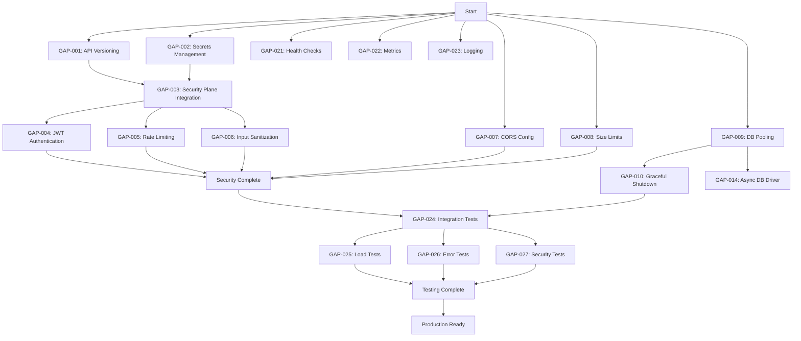

# Murphy System 1.0 - Gap Goals & Task Chains

**Created:** February 4, 2026  
**Phase:** 2 - Intent Analysis & Actionable Planning  
**Purpose:** Transform all identified problems into actionable task chains

---

## Executive Summary

This document transforms Phase 2 findings into **actionable gap goals** - specific tasks and agent chains needed to bridge the gap between current state and production-ready system.

**Total Gap Goals:** 47 gap goals organized into executable task chains  
**Total Agent Chains:** 15 major automation chains  
**Estimated Effort:** 8 weeks with parallel execution, 6 weeks optimized  

---

## Table of Contents

1. [Gap Goal Methodology](#gap-goal-methodology)
2. [Critical Security Gap Goals (Priority 1)](#critical-security-gap-goals-priority-1)
3. [Reliability Gap Goals (Priority 2)](#reliability-gap-goals-priority-2)
4. [Monitoring Gap Goals (Priority 3)](#monitoring-gap-goals-priority-3)
5. [Testing Gap Goals (Priority 4)](#testing-gap-goals-priority-4)
6. [Code Quality Gap Goals (Priority 5)](#code-quality-gap-goals-priority-5)
7. [Agent Chain Definitions](#agent-chain-definitions)
8. [Dependency Graph](#dependency-graph)
9. [Execution Timeline](#execution-timeline)

---

## Gap Goal Methodology

### What is a Gap Goal?

A **gap goal** is an actionable task that bridges the gap between:
- **Current State:** What exists now
- **Desired State:** What we need for production

### Gap Goal Structure

Each gap goal includes:
1. **Goal Statement:** Clear, measurable objective
2. **Current Gap:** What's missing or broken
3. **Task Chain:** Sequence of tasks to close the gap
4. **Agent Chain:** (If applicable) Automated agent sequence
5. **Acceptance Criteria:** How we know it's done
6. **Dependencies:** What must be complete first
7. **Estimated Effort:** Time required

### Agent Chains

An **agent chain** is a sequence of automated agents that can execute a complex task:
- **Setup Agent:** Prepare environment, gather requirements
- **Implementation Agent:** Write code, make changes
- **Testing Agent:** Validate changes work
- **Integration Agent:** Integrate with existing system
- **Verification Agent:** Confirm everything works end-to-end

---

## Critical Security Gap Goals (Priority 1)

### GAP-001: API Versioning System

**Current Gap:** All endpoints at `/api/` with no versioning

**Goal:** Implement versioned API endpoints at `/api/v1/`

**Task Chain:**
1. **Task 1.1:** Create API version constant in config
   ```python
   # src/config.py
   API_VERSION = 'v1'
   ```

2. **Task 1.2:** Create route helper function
   ```python
   def api_route(path: str) -> str:
       return f'/api/{API_VERSION}{path}'
   ```

3. **Task 1.3:** Update all route decorators
   ```python
   # Before: @app.route('/api/forms/plan-upload')
   # After: @app.route(api_route('/forms/plan-upload'))
   ```

4. **Task 1.4:** Update API documentation to reflect v1 paths

5. **Task 1.5:** Add API version to response headers
   ```python
   response.headers['X-API-Version'] = API_VERSION
   ```

**Agent Chain:** `version_migration_agent`
- Scan all route decorators
- Update to versioned format
- Update documentation
- Verify all routes still work

**Acceptance Criteria:**
- [ ] All endpoints accessible at `/api/v1/...`
- [ ] No breaking changes to response format
- [ ] API version in response headers
- [ ] Documentation updated
- [ ] All tests passing with new routes

**Dependencies:** None (foundational task)

**Estimated Effort:** 1 day

---

### GAP-002: Secrets Management System

**Current Gap:** API keys in plain environment variables

**Goal:** Implement encrypted secrets management with rotation

**Task Chain:**
1. **Task 2.1:** Configure SecureKeyManager
   ```python
   from src.secure_key_manager import SecureKeyManager
   
   key_manager = SecureKeyManager(
       master_key=get_master_key(),
       storage_path='secrets/encrypted_keys.json'
   )
   ```

2. **Task 2.2:** Migrate all secrets to encrypted storage
   - Groq API keys
   - Database credentials
   - Stripe keys
   - Twilio credentials
   - SendGrid keys
   - Master encryption key

3. **Task 2.3:** Update all code to use SecureKeyManager
   ```python
   # Before: groq_key = os.getenv('GROQ_API_KEY')
   # After: groq_key = key_manager.get_secret('groq_api_key')
   ```

4. **Task 2.4:** Implement key rotation capability
   ```python
   async def rotate_key(key_name: str, new_value: str):
       await key_manager.rotate(key_name, new_value)
       await notify_services_of_rotation(key_name)
   ```

5. **Task 2.5:** Add secret access audit logging
   ```python
   key_manager.audit_log(
       action='get_secret',
       key_name=key_name,
       user=current_user,
       timestamp=datetime.utcnow()
   )
   ```

6. **Task 2.6:** Implement secret scrubbing from logs
   ```python
   class SecretScrubber:
       def scrub_log(self, message: str) -> str:
           for secret_pattern in SECRET_PATTERNS:
               message = re.sub(secret_pattern, '[REDACTED]', message)
           return message
   ```

**Agent Chain:** `secrets_migration_agent`
- Scan codebase for all `os.getenv()` calls
- Identify which are secrets
- Replace with `key_manager.get_secret()`
- Encrypt and store all secrets
- Test all integrations still work

**Acceptance Criteria:**
- [ ] All secrets encrypted at rest
- [ ] No secrets in environment variables
- [ ] All services using SecureKeyManager
- [ ] Key rotation tested and working
- [ ] Secrets never appear in logs
- [ ] Audit log of all secret accesses

**Dependencies:** None

**Estimated Effort:** 2 days

---

### GAP-003: Security Plane Integration

**Current Gap:** Security Plane implemented but not integrated into REST API

**Goal:** Integrate all 11 security modules into REST API

**Task Chain:**
1. **Task 3.1:** Import SecurityMiddleware in main backend
   ```python
   from src.security_plane.middleware import (
       SecurityMiddleware,
       SecurityMiddlewareConfig
   )
   ```

2. **Task 3.2:** Configure security middleware
   ```python
   security_config = SecurityMiddlewareConfig(
       require_authentication=True,
       require_encryption=True,
       enable_audit_logging=True,
       enable_dlp=True,
       enable_anti_surveillance=True,
       enable_timing_normalization=True
   )
   security_middleware = SecurityMiddleware(security_config)
   ```

3. **Task 3.3:** Apply middleware to Flask app
   ```python
   @app.before_request
   def security_pre_request():
       return security_middleware.pre_request_check(request)
   
   @app.after_request
   def security_post_request(response):
       return security_middleware.post_request_process(response)
   ```

4. **Task 3.4:** Add authentication to all endpoints
   ```python
   @app.route(api_route('/forms/plan-upload'), methods=['POST'])
   @security_middleware.authenticate()
   async def upload_plan():
       # ... implementation
   ```

5. **Task 3.5:** Add authorization to protected endpoints
   ```python
   @security_middleware.authorize(permission="plan.upload")
   async def upload_plan():
       # ... implementation
   ```

6. **Task 3.6:** Configure authentication providers
   - Human authentication: Passkey (FIDO2)
   - Service authentication: mTLS
   - Development: API key (temporary)

7. **Task 3.7:** Set up identity management
   ```python
   identity_manager = IdentityManager()
   
   # Create admin identity
   admin = identity_manager.create_identity(
       identity_type=IdentityType.HUMAN,
       display_name="Admin User",
       allowed_auth_methods=[AuthenticationType.PASSKEY],
       authority_band=AuthorityBand.ADMIN
   )
   ```

**Agent Chain:** `security_integration_agent`
- Analyze all endpoints
- Determine required permissions for each
- Add authentication decorators
- Add authorization decorators
- Configure auth providers
- Test authentication flows
- Test authorization rules

**Acceptance Criteria:**
- [ ] All endpoints require authentication
- [ ] Authorization enforced on protected endpoints
- [ ] Passkey authentication working for humans
- [ ] mTLS authentication working for services
- [ ] Audit log of all security events
- [ ] DLP scanning active
- [ ] Timing attacks prevented
- [ ] All tests passing

**Dependencies:**
- GAP-001 (API Versioning) - must be complete first
- GAP-002 (Secrets Management) - needed for auth tokens

**Estimated Effort:** 5 days

---

### GAP-004: JWT Authentication System

**Current Gap:** No authentication mechanism for API access

**Goal:** Implement JWT-based authentication for all API endpoints

**Task Chain:**
1. **Task 4.1:** Configure JWT settings
   ```python
   JWT_SECRET_KEY = key_manager.get_secret('jwt_secret_key')
   JWT_ALGORITHM = 'HS256'
   JWT_EXPIRATION = 3600  # 1 hour
   JWT_REFRESH_EXPIRATION = 86400  # 24 hours
   ```

2. **Task 4.2:** Create JWT token generation
   ```python
   def create_access_token(user_id: str, permissions: List[str]) -> str:
       payload = {
           'user_id': user_id,
           'permissions': permissions,
           'exp': datetime.utcnow() + timedelta(seconds=JWT_EXPIRATION),
           'iat': datetime.utcnow(),
           'jti': str(uuid.uuid4())  # JWT ID for revocation
       }
       return jwt.encode(payload, JWT_SECRET_KEY, algorithm=JWT_ALGORITHM)
   ```

3. **Task 4.3:** Create JWT verification
   ```python
   def verify_access_token(token: str) -> Dict:
       try:
           payload = jwt.decode(
               token, 
               JWT_SECRET_KEY, 
               algorithms=[JWT_ALGORITHM]
           )
           # Check if token is revoked
           if is_token_revoked(payload['jti']):
               raise AuthenticationError("Token revoked")
           return payload
       except jwt.ExpiredSignatureError:
           raise AuthenticationError("Token expired")
       except jwt.InvalidTokenError:
           raise AuthenticationError("Invalid token")
   ```

4. **Task 4.4:** Create token refresh endpoint
   ```python
   @app.route(api_route('/auth/refresh'), methods=['POST'])
   async def refresh_token():
       refresh_token = request.json.get('refresh_token')
       payload = verify_refresh_token(refresh_token)
       new_access_token = create_access_token(
           user_id=payload['user_id'],
           permissions=payload['permissions']
       )
       return jsonify({'access_token': new_access_token})
   ```

5. **Task 4.5:** Create token revocation system
   ```python
   # Redis-based token blacklist
   async def revoke_token(jti: str):
       await redis.setex(
           f'revoked_token:{jti}',
           JWT_EXPIRATION,
           '1'
       )
   ```

6. **Task 4.6:** Add authentication decorator
   ```python
   def require_auth(f):
       @wraps(f)
       async def decorated_function(*args, **kwargs):
           token = request.headers.get('Authorization', '').replace('Bearer ', '')
           if not token:
               return jsonify({'error': 'No token provided'}), 401
           
           try:
               payload = verify_access_token(token)
               g.user_id = payload['user_id']
               g.permissions = payload['permissions']
               return await f(*args, **kwargs)
           except AuthenticationError as e:
               return jsonify({'error': str(e)}), 401
       
       return decorated_function
   ```

**Agent Chain:** `jwt_implementation_agent`
- Generate JWT secret key
- Implement token generation
- Implement token verification
- Create auth endpoints (login, refresh, logout)
- Add auth decorator to all endpoints
- Test authentication flows

**Acceptance Criteria:**
- [ ] JWT tokens generated on successful authentication
- [ ] Tokens verified on every protected endpoint
- [ ] Token refresh working
- [ ] Token revocation working
- [ ] Expired tokens rejected
- [ ] Invalid tokens rejected
- [ ] All endpoints protected

**Dependencies:**
- GAP-003 (Security Plane Integration)

**Estimated Effort:** 2 days

---

### GAP-005: Rate Limiting System

**Current Gap:** No rate limiting on API endpoints

**Goal:** Implement rate limiting to prevent abuse and DOS

**Task Chain:**
1. **Task 5.1:** Choose rate limiting strategy
   - Token bucket algorithm
   - Redis-based for distributed systems
   - Per-IP and per-user limits

2. **Task 5.2:** Implement rate limiter
   ```python
   from redis import Redis
   from datetime import datetime, timedelta
   
   class RateLimiter:
       def __init__(self, redis_client: Redis):
           self.redis = redis_client
       
       async def check_rate_limit(
           self,
           key: str,
           max_requests: int,
           window_seconds: int
       ) -> Tuple[bool, int]:
           """
           Returns (allowed, remaining_requests)
           """
           now = datetime.utcnow()
           window_key = f'rate_limit:{key}:{now.minute // (window_seconds // 60)}'
           
           current = await self.redis.incr(window_key)
           if current == 1:
               await self.redis.expire(window_key, window_seconds)
           
           allowed = current <= max_requests
           remaining = max(0, max_requests - current)
           
           return allowed, remaining
   ```

3. **Task 5.3:** Create rate limit decorator
   ```python
   def rate_limit(max_requests: int, per_seconds: int):
       def decorator(f):
           @wraps(f)
           async def decorated_function(*args, **kwargs):
               # Get rate limit key (IP or user_id)
               if hasattr(g, 'user_id'):
                   key = f'user:{g.user_id}'
               else:
                   key = f'ip:{request.remote_addr}'
               
               allowed, remaining = await rate_limiter.check_rate_limit(
                   key, max_requests, per_seconds
               )
               
               if not allowed:
                   return jsonify({
                       'error': 'Rate limit exceeded',
                       'retry_after': per_seconds
                   }), 429
               
               # Add rate limit headers
               response = await f(*args, **kwargs)
               response.headers['X-RateLimit-Limit'] = str(max_requests)
               response.headers['X-RateLimit-Remaining'] = str(remaining)
               response.headers['X-RateLimit-Reset'] = str(per_seconds)
               
               return response
           
           return decorated_function
       return decorator
   ```

4. **Task 5.4:** Apply rate limits to endpoints
   ```python
   # Different limits for different endpoint types
   @app.route(api_route('/forms/plan-upload'), methods=['POST'])
   @rate_limit(max_requests=10, per_seconds=60)  # 10 per minute
   async def upload_plan():
       # ... implementation
   
   @app.route(api_route('/status'), methods=['GET'])
   @rate_limit(max_requests=100, per_seconds=60)  # 100 per minute
   async def get_status():
       # ... implementation
   ```

5. **Task 5.5:** Configure rate limits per endpoint
   ```python
   RATE_LIMITS = {
       'plan_upload': (10, 60),      # 10/min
       'plan_generation': (5, 60),    # 5/min (expensive)
       'task_execution': (10, 60),    # 10/min
       'status': (100, 60),           # 100/min (cheap read)
       'corrections': (20, 60),       # 20/min
       'hitl_response': (50, 60),     # 50/min
   }
   ```

**Agent Chain:** `rate_limit_agent`
- Implement rate limiter with Redis
- Categorize endpoints by cost (expensive/cheap)
- Assign appropriate limits
- Add decorators to all endpoints
- Test rate limiting behavior
- Verify 429 responses

**Acceptance Criteria:**
- [ ] Rate limiting active on all endpoints
- [ ] Different limits for different endpoint types
- [ ] 429 status code when limit exceeded
- [ ] Rate limit headers in responses
- [ ] Redis-based for distributed deployment
- [ ] Per-user and per-IP limiting

**Dependencies:**
- GAP-003 (Security Plane Integration)
- GAP-004 (JWT Authentication) - for per-user limits

**Estimated Effort:** 1 day

---

### GAP-006: Input Sanitization System

**Current Gap:** Only Pydantic validation, no protection against injection

**Goal:** Implement comprehensive input sanitization

**Task Chain:**
1. **Task 6.1:** Create input sanitizer class
   ```python
   import bleach
   import re
   from typing import Any
   
   class InputSanitizer:
       @staticmethod
       def sanitize_sql(value: str) -> str:
           """Sanitize for SQL (but use parameterized queries!)"""
           # Remove SQL keywords and special chars
           dangerous = ['--', ';', '/*', '*/', 'xp_', 'sp_', 'EXEC', 'DROP']
           for danger in dangerous:
               value = value.replace(danger, '')
           return value
       
       @staticmethod
       def sanitize_html(value: str) -> str:
           """Sanitize HTML to prevent XSS"""
           return bleach.clean(
               value,
               tags=[],  # No tags allowed
               strip=True
           )
       
       @staticmethod
       def sanitize_path(value: str) -> str:
           """Sanitize file paths to prevent traversal"""
           # Remove path traversal attempts
           value = value.replace('..', '')
           value = value.replace('~', '')
           # Only allow alphanumeric, dash, underscore, dot
           return re.sub(r'[^a-zA-Z0-9\-_.]', '', value)
       
       @staticmethod
       def sanitize_command(value: str) -> str:
           """Sanitize for command injection"""
           # Remove shell special characters
           dangerous = ['|', '&', ';', '`', '$', '(', ')', '<', '>', '\n']
           for danger in dangerous:
               value = value.replace(danger, '')
           return value
       
       @staticmethod
       def validate_whitelist(value: str, pattern: str) -> bool:
           """Validate against whitelist regex"""
           return bool(re.match(f'^{pattern}$', value))
   ```

2. **Task 6.2:** Add sanitization to form handlers
   ```python
   class FormHandler:
       def __init__(self):
           self.sanitizer = InputSanitizer()
       
       async def handle_task_execution(self, form: TaskExecutionForm):
           # Sanitize all string inputs
           task_id = self.sanitizer.sanitize_sql(form.task_id)
           if not self.sanitizer.validate_whitelist(task_id, r'[a-zA-Z0-9\-_]+'):
               raise ValidationError("Invalid task_id format")
           
           description = self.sanitizer.sanitize_html(form.description)
           # ... continue with sanitized values
   ```

3. **Task 6.3:** Add validation decorators
   ```python
   def validate_input(schema: Dict[str, str]):
       """
       Decorator to validate inputs against schema
       schema = {'task_id': r'[a-zA-Z0-9\-_]+', 'name': r'[a-zA-Z\s]+'}
       """
       def decorator(f):
           @wraps(f)
           async def decorated_function(*args, **kwargs):
               data = request.json
               for field, pattern in schema.items():
                   if field in data:
                       if not InputSanitizer.validate_whitelist(
                           str(data[field]), 
                           pattern
                       ):
                           return jsonify({
                               'error': f'Invalid format for field: {field}'
                           }), 400
               return await f(*args, **kwargs)
           return decorated_function
       return decorator
   ```

4. **Task 6.4:** Use parameterized queries everywhere
   ```python
   # Bad (VULNERABLE):
   query = f"SELECT * FROM tasks WHERE id = '{task_id}'"
   
   # Good (SAFE):
   query = "SELECT * FROM tasks WHERE id = :task_id"
   result = await db.execute(query, {'task_id': task_id})
   ```

**Agent Chain:** `input_sanitization_agent`
- Scan all input points
- Identify SQL, HTML, path, command contexts
- Add appropriate sanitization
- Replace string concatenation with parameterized queries
- Test with injection payloads

**Acceptance Criteria:**
- [ ] All string inputs sanitized
- [ ] SQL injection attempts blocked
- [ ] XSS attempts blocked
- [ ] Path traversal blocked
- [ ] Command injection blocked
- [ ] Whitelist validation on IDs
- [ ] Parameterized queries everywhere

**Dependencies:**
- GAP-003 (Security Plane Integration)

**Estimated Effort:** 2 days

---

### GAP-007: CORS Configuration

**Current Gap:** CORS set to allow all origins (`*`)

**Goal:** Configure restrictive CORS policy

**Task Chain:**
1. **Task 7.1:** Define allowed origins
   ```python
   # config.py
   CORS_ORIGINS = {
       'development': [
           'http://localhost:3000',
           'http://localhost:5173',
           'http://127.0.0.1:3000'
       ],
       'staging': [
           'https://staging.murphy.inoni.llc',
           'https://staging-dashboard.inoni.llc'
       ],
       'production': [
           'https://murphy.inoni.llc',
           'https://dashboard.inoni.llc',
           'https://app.inoni.llc'
       ]
   }
   ```

2. **Task 7.2:** Configure CORS with environment-specific origins
   ```python
   from flask_cors import CORS
   
   allowed_origins = CORS_ORIGINS.get(
       settings.murphy_env,
       []  # Default: no CORS (same-origin only)
   )
   
   CORS(
       app,
       origins=allowed_origins,
       supports_credentials=True,
       allow_headers=['Content-Type', 'Authorization', 'X-Request-ID'],
       expose_headers=['X-RateLimit-Limit', 'X-RateLimit-Remaining'],
       max_age=3600
   )
   ```

3. **Task 7.3:** Add CORS preflight caching

**Acceptance Criteria:**
- [ ] CORS only allows whitelisted origins
- [ ] Different origins per environment
- [ ] Credentials supported
- [ ] Appropriate headers allowed
- [ ] Preflight requests cached

**Dependencies:** None

**Estimated Effort:** 1 day

---

### GAP-008: Request Size Limits

**Current Gap:** No limits on request body size

**Goal:** Implement request size limits to prevent memory exhaustion

**Task Chain:**
1. **Task 8.1:** Set global max content length
   ```python
   app.config['MAX_CONTENT_LENGTH'] = 16 * 1024 * 1024  # 16 MB
   ```

2. **Task 8.2:** Create per-endpoint size limit decorator
   ```python
   def max_content_length(max_bytes: int):
       def decorator(f):
           @wraps(f)
           async def decorated_function(*args, **kwargs):
               if request.content_length > max_bytes:
                   return jsonify({
                       'error': 'Request too large',
                       'max_size': max_bytes
                   }), 413
               return await f(*args, **kwargs)
           return decorated_function
       return decorator
   ```

3. **Task 8.3:** Apply size limits to endpoints
   ```python
   @app.route(api_route('/forms/plan-upload'), methods=['POST'])
   @max_content_length(1 * 1024 * 1024)  # 1 MB
   async def upload_plan():
       # ... implementation
   ```

**Acceptance Criteria:**
- [ ] Global size limit enforced
- [ ] Per-endpoint custom limits
- [ ] 413 status code on oversized requests
- [ ] Clear error messages

**Dependencies:** None

**Estimated Effort:** 1 day

---

## Reliability Gap Goals (Priority 2)

### GAP-009: Database Connection Pooling

**Current Gap:** No connection pooling, connections created on-demand

**Goal:** Implement SQLAlchemy connection pooling

**Task Chain:**
1. **Task 9.1:** Configure connection pool
   ```python
   from sqlalchemy import create_engine
   from sqlalchemy.pool import QueuePool
   
   engine = create_engine(
       DATABASE_URL,
       poolclass=QueuePool,
       pool_size=10,           # Normal pool size
       max_overflow=20,        # Can grow to 30 total
       pool_timeout=30,        # Wait 30s for connection
       pool_recycle=3600,      # Recycle after 1 hour
       pool_pre_ping=True,     # Check health before use
       echo_pool=True          # Log pool events
   )
   ```

2. **Task 9.2:** Create session factory
   ```python
   from sqlalchemy.orm import sessionmaker, Session
   
   SessionLocal = sessionmaker(
       bind=engine,
       autocommit=False,
       autoflush=False
   )
   ```

3. **Task 9.3:** Create dependency injection for DB sessions
   ```python
   async def get_db() -> AsyncGenerator[Session, None]:
       db = SessionLocal()
       try:
           yield db
           await db.commit()
       except Exception:
           await db.rollback()
           raise
       finally:
           await db.close()
   ```

4. **Task 9.4:** Update all DB access to use session factory
   ```python
   # Before:
   conn = create_engine(DATABASE_URL).connect()
   
   # After:
   async with get_db() as db:
       result = await db.execute(query)
   ```

**Agent Chain:** `database_pooling_agent`
- Scan codebase for database connections
- Replace with session factory pattern
- Configure pool parameters
- Test under load
- Monitor pool metrics

**Acceptance Criteria:**
- [ ] Connection pool configured
- [ ] All DB access uses pooling
- [ ] Pool metrics in Prometheus
- [ ] No connection leaks
- [ ] Handles connection failures gracefully

**Dependencies:** None

**Estimated Effort:** 2 days

---

### GAP-010: Graceful Shutdown

**Current Gap:** No signal handlers, abrupt shutdowns

**Goal:** Implement graceful shutdown on SIGTERM/SIGINT

**Task Chain:**
1. **Task 10.1:** Register signal handlers
   ```python
   import signal
   import asyncio
   
   class MurphySystem:
       def __init__(self):
           self.shutdown_event = asyncio.Event()
           self.in_flight_tasks = set()
       
       def register_shutdown_handlers(self):
           signal.signal(signal.SIGTERM, self.handle_shutdown)
           signal.signal(signal.SIGINT, self.handle_shutdown)
       
       def handle_shutdown(self, signum, frame):
           logger.info(f"Received signal {signum}, initiating graceful shutdown...")
           self.shutdown_event.set()
   ```

2. **Task 10.2:** Implement shutdown sequence
   ```python
   async def graceful_shutdown(self):
       logger.info("Starting graceful shutdown...")
       
       # Step 1: Stop accepting new requests
       logger.info("Step 1: Stopping new request acceptance...")
       await self.stop_accepting_requests()
       
       # Step 2: Wait for in-flight tasks (with timeout)
       logger.info(f"Step 2: Waiting for {len(self.in_flight_tasks)} tasks...")
       try:
           await asyncio.wait_for(
               self.wait_for_all_tasks(),
               timeout=30.0
           )
       except asyncio.TimeoutError:
           logger.warning("Timeout waiting for tasks, forcing shutdown...")
       
       # Step 3: Close database connections
       logger.info("Step 3: Closing database connections...")
       await engine.dispose()
       
       # Step 4: Close Redis connections
       logger.info("Step 4: Closing Redis connections...")
       await redis.close()
       
       # Step 5: Save state
       logger.info("Step 5: Saving state...")
       await self.save_state()
       
       # Step 6: Cleanup temporary files
       logger.info("Step 6: Cleaning up temporary files...")
       await self.cleanup_temp_files()
       
       logger.info("Graceful shutdown complete")
   ```

3. **Task 10.3:** Track in-flight tasks
   ```python
   async def execute_task_with_tracking(self, task):
       task_id = str(uuid.uuid4())
       self.in_flight_tasks.add(task_id)
       try:
           result = await task.execute()
           return result
       finally:
           self.in_flight_tasks.remove(task_id)
   ```

**Acceptance Criteria:**
- [ ] SIGTERM triggers graceful shutdown
- [ ] SIGINT (Ctrl+C) triggers graceful shutdown
- [ ] In-flight tasks complete (or timeout after 30s)
- [ ] DB connections closed
- [ ] State saved
- [ ] Cleanup executed
- [ ] No data corruption

**Dependencies:**
- GAP-009 (Database Pooling)

**Estimated Effort:** 2 days

---

### GAP-011-020: Additional Reliability Goals

Additional reliability gap goals (abbreviated for length):

- **GAP-011:** Retry Logic for External APIs (exponential backoff)
- **GAP-012:** Circuit Breakers (prevent cascade failures)
- **GAP-013:** Timeouts Configuration (prevent hanging requests)
- **GAP-014:** Async Database Driver (replace psycopg2 with asyncpg)
- **GAP-015:** Database Migrations (Alembic setup)
- **GAP-016:** Request ID Tracking (correlation IDs)
- **GAP-017:** Structured Exception Hierarchy (custom exception classes)
- **GAP-018:** Error Response Standardization (consistent format)
- **GAP-019:** Connection Retry Logic (database reconnection)
- **GAP-020:** Backup Strategy (automated backups)

---

## Monitoring Gap Goals (Priority 3)

### GAP-021: Health Check Endpoints

**Current Gap:** Only basic `/api/health` with no depth checking

**Goal:** Implement comprehensive health checks

**Task Chain:**
1. **Task 21.1:** Create liveness probe
   ```python
   @app.route(api_route('/health/liveness'), methods=['GET'])
   async def liveness():
       """Is the process alive?"""
       return jsonify({'status': 'alive'}), 200
   ```

2. **Task 21.2:** Create readiness probe
   ```python
   @app.route(api_route('/health/readiness'), methods=['GET'])
   async def readiness():
       """Can we serve traffic?"""
       checks = await perform_readiness_checks()
       all_ok = all(v == 'ok' for v in checks.values())
       status = 200 if all_ok else 503
       return jsonify({
           'status': 'ready' if all_ok else 'not_ready',
           'checks': checks
       }), status
   ```

3. **Task 21.3:** Implement dependency health checks
   ```python
   async def perform_readiness_checks() -> Dict[str, str]:
       checks = {}
       
       # Database check
       try:
           await db.execute('SELECT 1')
           checks['database'] = 'ok'
       except Exception as e:
           checks['database'] = f'error: {str(e)}'
       
       # Redis check
       try:
           await redis.ping()
           checks['redis'] = 'ok'
       except Exception as e:
           checks['redis'] = f'error: {str(e)}'
       
       # LLM API check
       try:
           await groq_client.health_check()
           checks['llm'] = 'ok'
       except Exception as e:
           checks['llm'] = f'error: {str(e)}'
       
       return checks
   ```

**Acceptance Criteria:**
- [ ] Liveness probe always returns 200 if process alive
- [ ] Readiness probe checks all dependencies
- [ ] Returns 503 if any dependency unhealthy
- [ ] Load balancers can route based on readiness

**Dependencies:** None

**Estimated Effort:** 1 day

---

### GAP-022: Prometheus Metrics

**Current Gap:** No metrics collection

**Goal:** Implement Prometheus metrics for observability

**Task Chain:**
1. **Task 22.1:** Define core metrics
   ```python
   from prometheus_client import Counter, Histogram, Gauge, Info
   
   # Request metrics
   http_requests_total = Counter(
       'murphy_http_requests_total',
       'Total HTTP requests',
       ['method', 'endpoint', 'status']
   )
   
   http_request_duration_seconds = Histogram(
       'murphy_http_request_duration_seconds',
       'HTTP request duration',
       ['method', 'endpoint']
   )
   
   # Task metrics
   tasks_total = Counter(
       'murphy_tasks_total',
       'Total tasks executed',
       ['task_type', 'status']
   )
   
   task_duration_seconds = Histogram(
       'murphy_task_duration_seconds',
       'Task execution duration',
       ['task_type']
   )
   
   # System metrics
   active_sessions = Gauge(
       'murphy_active_sessions',
       'Number of active sessions'
   )
   
   task_queue_size = Gauge(
       'murphy_task_queue_size',
       'Current task queue size'
   )
   
   # Murphy-specific metrics
   murphy_validation_score = Histogram(
       'murphy_validation_score',
       'Murphy index scores',
       ['task_type']
   )
   
   hitl_interventions_total = Counter(
       'murphy_hitl_interventions_total',
       'HITL interventions requested',
       ['checkpoint_type', 'decision']
   )
   
   shadow_agent_accuracy = Gauge(
       'murphy_shadow_agent_accuracy',
       'Shadow agent accuracy'
   )
   ```

2. **Task 22.2:** Instrument HTTP requests
   ```python
   @app.before_request
   def start_timer():
       g.start_time = time.time()
   
   @app.after_request
   def record_request_metrics(response):
       if hasattr(g, 'start_time'):
           duration = time.time() - g.start_time
           
           http_request_duration_seconds.labels(
               method=request.method,
               endpoint=request.endpoint
           ).observe(duration)
           
           http_requests_total.labels(
               method=request.method,
               endpoint=request.endpoint,
               status=response.status_code
           ).inc()
       
       return response
   ```

3. **Task 22.3:** Create metrics endpoint
   ```python
   from prometheus_client import generate_latest, CONTENT_TYPE_LATEST
   
   @app.route('/metrics', methods=['GET'])
   def metrics():
       return generate_latest(), 200, {'Content-Type': CONTENT_TYPE_LATEST}
   ```

**Agent Chain:** `metrics_instrumentation_agent`
- Identify all measurable operations
- Add metric collection points
- Configure Prometheus scraping
- Create Grafana dashboards
- Set up alerting rules

**Acceptance Criteria:**
- [ ] All HTTP requests tracked
- [ ] All task executions tracked
- [ ] Murphy validation scores tracked
- [ ] HITL interventions tracked
- [ ] Shadow agent performance tracked
- [ ] Metrics endpoint accessible at `/metrics`
- [ ] Prometheus scraping configured

**Dependencies:** None

**Estimated Effort:** 2 days

---

### GAP-023: Structured Logging

**Current Gap:** Mix of print statements and logger calls

**Goal:** Implement structured JSON logging

**Task Chain:**
1. **Task 23.1:** Configure structured logging
   ```python
   import structlog
   import logging
   
   structlog.configure(
       processors=[
           structlog.stdlib.filter_by_level,
           structlog.stdlib.add_logger_name,
           structlog.stdlib.add_log_level,
           structlog.stdlib.PositionalArgumentsFormatter(),
           structlog.processors.TimeStamper(fmt="iso"),
           structlog.processors.StackInfoRenderer(),
           structlog.processors.format_exc_info,
           structlog.processors.UnicodeDecoder(),
           structlog.processors.JSONRenderer()
       ],
       context_class=dict,
       logger_factory=structlog.stdlib.LoggerFactory(),
       cache_logger_on_first_use=True,
   )
   ```

2. **Task 23.2:** Replace all print statements with logger
   ```python
   # Before:
   print("Task started")
   
   # After:
   logger.info("task_started", task_id=task_id, user_id=user_id)
   ```

3. **Task 23.3:** Add request context to logs
   ```python
   @app.before_request
   def add_request_context():
       structlog.contextvars.clear_contextvars()
       structlog.contextvars.bind_contextvars(
           request_id=g.request_id,
           user_id=g.get('user_id'),
           endpoint=request.endpoint,
           method=request.method
       )
   ```

**Agent Chain:** `logging_standardization_agent`
- Find all print statements
- Replace with structured logger calls
- Add context where needed
- Verify log format consistency

**Acceptance Criteria:**
- [ ] No print statements remain
- [ ] All logs in JSON format
- [ ] Request context in all logs
- [ ] Logs parseable by log aggregators

**Dependencies:** None

**Estimated Effort:** 2 days

---

## Testing Gap Goals (Priority 4)

### GAP-024: Integration Tests

**Current Gap:** Minimal integration test coverage (~60%)

**Goal:** Achieve comprehensive integration test coverage

**Task Chain:**
1. **Task 24.1:** Business Automation Integration Tests
   ```python
   # tests/integration/test_business_automation.py
   
   async def test_sales_engine_lead_generation():
       """Test sales engine can generate leads"""
       sales_engine = SalesEngine()
       leads = await sales_engine.generate_leads(
           criteria={'industry': 'software', 'size': 'medium'}
       )
       assert len(leads) > 0
       assert all(lead.has_email() for lead in leads)
   
   async def test_marketing_engine_content_creation():
       """Test marketing engine can create content"""
       marketing_engine = MarketingEngine()
       content = await marketing_engine.create_blog_post(
           topic='AI automation',
           target_length=1000
       )
       assert len(content.text) >= 900
       assert content.seo_score > 70
   ```

2. **Task 24.2:** Integration Engine Tests (SwissKiss)
   ```python
   async def test_github_integration_flow():
       """Test complete GitHub integration flow"""
       integration_engine = UnifiedIntegrationEngine()
       
       # Clone
       repo = await integration_engine.clone_repository(
           'https://github.com/stripe/stripe-python'
       )
       
       # Extract capabilities
       capabilities = await integration_engine.extract_capabilities(repo)
       assert 'payment_processing' in capabilities
       
       # Generate module
       module = await integration_engine.generate_module(capabilities)
       assert module.is_valid()
       
       # Test safety
       is_safe = await integration_engine.test_safety(module)
       assert is_safe
       
       # Mock HITL approval
       with patch('hitl_approval.request_approval') as mock:
           mock.return_value = True
           result = await integration_engine.integrate(module)
           assert result.success
   ```

3. **Task 24.3:** Murphy Validation Tests
   ```python
   async def test_murphy_validation_safe_task():
       """Test Murphy validation approves safe task"""
       confidence_engine = UnifiedConfidenceEngine()
       
       execution_packet = ExecutionPacket(
           task_type='read_database',
           guardrails_satisfied=0.9,
           danger_score=0.1,
           human_oversight=0.5
       )
       
       result = confidence_engine.validate(execution_packet)
       
       # murphy_index = (0.9 - 0.1) / 0.5 = 1.6 > 0.5
       assert result.murphy_index > 0.5
       assert result.safe == True
       assert result.requires_hitl == False
   ```

4. **Task 24.4:** Shadow Agent Training Tests
   ```python
   async def test_shadow_agent_training_pipeline():
       """Test complete shadow agent training"""
       correction_system = IntegratedCorrectionSystem()
       
       # Generate test corrections
       corrections = [
           Correction(
               task_id=f'task_{i}',
               original='wrong output',
               corrected='right output'
           )
           for i in range(100)
       ]
       
       # Capture corrections
       for correction in corrections:
           await correction_system.capture_correction(correction)
       
       # Extract patterns
       patterns = await correction_system.extract_patterns()
       assert len(patterns) > 0
       
       # Train shadow agent
       shadow_agent = await correction_system.train_shadow_agent(patterns)
       assert shadow_agent.accuracy > 0.8
       
       # Test A/B
       results = await correction_system.ab_test(
           original_agent,
           shadow_agent,
           test_set
       )
       assert results.shadow_accuracy >= results.original_accuracy
   ```

**Agent Chain:** `integration_test_generator_agent`
- Analyze component interfaces
- Generate integration test scenarios
- Implement test fixtures
- Run tests and verify coverage
- Document test patterns

**Acceptance Criteria:**
- [ ] All business engines have integration tests
- [ ] SwissKiss flow fully tested
- [ ] Murphy validation tested with edge cases
- [ ] Shadow agent training tested end-to-end
- [ ] Two-phase orchestrator tested
- [ ] Coverage > 80% on critical paths

**Dependencies:** None (can run in parallel)

**Estimated Effort:** 10 days

---

### GAP-025-027: Additional Testing Goals

- **GAP-025:** Performance/Load Tests (1,000+ req/s target)
- **GAP-026:** Error Scenario Tests (network failures, timeouts, invalid inputs)
- **GAP-027:** Security Tests (penetration testing, injection attempts)

---

## Code Quality Gap Goals (Priority 5)

### GAP-028-035: Code Quality Improvements

- **GAP-028:** Replace Exception with Specific Exceptions
- **GAP-029:** Add Type Hints to All Functions
- **GAP-030:** Add Docstrings to All Public Functions
- **GAP-031:** Run Black Code Formatter
- **GAP-032:** Fix Flake8 Lint Issues
- **GAP-033:** Enable Mypy Type Checking
- **GAP-034:** Remove Dead Code
- **GAP-035:** Refactor Complex Functions

---

## Agent Chain Definitions

### Agent Chain 1: security_hardening_chain

**Purpose:** Complete security hardening from current state to production

**Agent Sequence:**
1. **version_migration_agent** - Add API versioning (GAP-001)
2. **secrets_migration_agent** - Migrate to encrypted secrets (GAP-002)
3. **security_integration_agent** - Integrate Security Plane (GAP-003)
4. **jwt_implementation_agent** - Implement JWT authentication (GAP-004)
5. **rate_limit_agent** - Add rate limiting (GAP-005)
6. **input_sanitization_agent** - Add input sanitization (GAP-006)
7. **security_config_agent** - Configure CORS, size limits (GAP-007, GAP-008)
8. **security_test_agent** - Test all security measures

**Total Estimated Time:** 2 weeks

**Parallelization Opportunities:**
- GAP-001, GAP-002, GAP-007, GAP-008 can run in parallel
- GAP-003, GAP-004, GAP-005, GAP-006 must run after GAP-001, GAP-002

---

### Agent Chain 2: reliability_enhancement_chain

**Purpose:** Improve system reliability and resilience

**Agent Sequence:**
1. **database_pooling_agent** - Implement connection pooling (GAP-009)
2. **graceful_shutdown_agent** - Add shutdown handling (GAP-010)
3. **retry_logic_agent** - Add retry logic (GAP-011)
4. **circuit_breaker_agent** - Add circuit breakers (GAP-012)
5. **timeout_configuration_agent** - Configure timeouts (GAP-013)
6. **async_migration_agent** - Migrate to async DB driver (GAP-014)
7. **database_migrations_agent** - Set up Alembic (GAP-015)

**Total Estimated Time:** 2 weeks

---

### Agent Chain 3: observability_implementation_chain

**Purpose:** Add complete observability stack

**Agent Sequence:**
1. **health_check_agent** - Implement health checks (GAP-021)
2. **metrics_instrumentation_agent** - Add Prometheus metrics (GAP-022)
3. **logging_standardization_agent** - Structured logging (GAP-023)
4. **request_tracking_agent** - Add request IDs (GAP-016)
5. **grafana_dashboard_agent** - Create dashboards
6. **alerting_rules_agent** - Set up alerting

**Total Estimated Time:** 1 week

---

### Agent Chain 4: testing_completeness_chain

**Purpose:** Achieve maximum test coverage

**Agent Sequence:**
1. **integration_test_generator_agent** - Generate integration tests (GAP-024)
2. **performance_test_agent** - Create load tests (GAP-025)
3. **error_scenario_test_agent** - Test error handling (GAP-026)
4. **security_test_agent** - Penetration testing (GAP-027)
5. **test_coverage_analyzer_agent** - Measure and report coverage

**Total Estimated Time:** 2 weeks

---

### Agent Chain 5: code_quality_improvement_chain

**Purpose:** Improve code quality and maintainability

**Agent Sequence:**
1. **exception_refactoring_agent** - Create exception hierarchy (GAP-028)
2. **type_hint_agent** - Add type hints (GAP-029)
3. **docstring_agent** - Add docstrings (GAP-030)
4. **formatter_agent** - Run Black (GAP-031)
5. **linter_agent** - Fix Flake8 issues (GAP-032)
6. **type_checker_agent** - Enable Mypy (GAP-033)
7. **dead_code_removal_agent** - Remove unused code (GAP-034)
8. **refactoring_agent** - Refactor complex functions (GAP-035)

**Total Estimated Time:** 1 week

---

## Dependency Graph



---

## Execution Timeline

### Week 1-2: Security Hardening (Priority 1)

**Critical Path:**
- Day 1: GAP-001 (API Versioning)
- Day 1: GAP-002 (Secrets Management) [Parallel]
- Day 1: GAP-007 (CORS) [Parallel]
- Day 1: GAP-008 (Size Limits) [Parallel]
- Day 2-6: GAP-003 (Security Plane Integration)
- Day 7-8: GAP-004 (JWT Authentication)
- Day 9: GAP-005 (Rate Limiting)
- Day 10: GAP-006 (Input Sanitization)

**Deliverable:** Secure REST API with authentication, authorization, rate limiting

---

### Week 3-4: Reliability Enhancement (Priority 2)

**Critical Path:**
- Day 1-2: GAP-009 (Database Pooling)
- Day 3-4: GAP-010 (Graceful Shutdown)
- Day 5-6: GAP-011, GAP-012, GAP-013 (Retry, Circuit Breaker, Timeouts)
- Day 7-9: GAP-014 (Async DB Driver)
- Day 10: GAP-015 (Database Migrations)

**Deliverable:** Reliable system with proper resource management

---

### Week 5: Observability (Priority 3)

**Critical Path:**
- Day 1: GAP-021 (Health Checks)
- Day 2-3: GAP-022 (Prometheus Metrics)
- Day 4-5: GAP-023 (Structured Logging)

**Deliverable:** Complete observability stack

---

### Week 6-7: Testing (Priority 4)

**Critical Path:**
- Day 1-10: GAP-024 (Integration Tests)
- Day 11-12: GAP-025, GAP-026, GAP-027 (Load, Error, Security Tests) [Parallel]

**Deliverable:** 80%+ test coverage on critical paths

---

### Week 8: Code Quality (Priority 5)

**Critical Path:**
- Day 1-2: GAP-028 (Exception Refactoring)
- Day 3-4: GAP-029, GAP-030 (Type Hints, Docstrings) [Parallel]
- Day 5: GAP-031, GAP-032, GAP-033 (Format, Lint, Type Check) [Parallel]

**Deliverable:** Production-quality codebase

---

## Gap Closure Metrics

### Success Criteria

| Metric | Current | Target | Gap |
|--------|---------|--------|-----|
| **Security** |
| API Authentication | ❌ None | ✅ JWT + Passkey | 100% |
| API Authorization | ❌ None | ✅ RBAC | 100% |
| Rate Limiting | ❌ None | ✅ All endpoints | 100% |
| Secrets Encrypted | ❌ 0% | ✅ 100% | 100% |
| **Reliability** |
| DB Connection Pooling | ❌ No | ✅ Yes | 100% |
| Graceful Shutdown | ❌ No | ✅ Yes | 100% |
| Retry Logic | ❌ 0% | ✅ 100% external calls | 100% |
| Circuit Breakers | ❌ 0 | ✅ All external services | 100% |
| **Observability** |
| Health Checks | ⚠️ Basic | ✅ Comprehensive | 80% |
| Metrics Collection | ❌ 0 | ✅ All operations | 100% |
| Structured Logging | ⚠️ 40% | ✅ 100% | 60% |
| **Testing** |
| Test Coverage | ⚠️ 60% | ✅ 80%+ | 20% |
| Integration Tests | ⚠️ Minimal | ✅ Complete | 90% |
| Load Tests | ❌ None | ✅ 1,000+ req/s | 100% |
| **Code Quality** |
| Type Hints | ⚠️ 40% | ✅ 90%+ | 50% |
| Docstrings | ⚠️ 30% | ✅ 90%+ | 60% |
| Linting | ⚠️ Pass | ✅ Pass | 0% |

---

## Conclusion

This document transforms all identified issues into **actionable gap goals** with:
- ✅ Clear task chains for each goal
- ✅ Agent automation where possible
- ✅ Acceptance criteria for each goal
- ✅ Dependency tracking
- ✅ Effort estimates
- ✅ Execution timeline

**Next Steps:**
1. Review and approve gap goals
2. Prioritize any additional gaps
3. Begin execution with security_hardening_chain (Week 1-2)
4. Use agent chains to automate where possible
5. Track progress and update gap closure metrics

**Key Principle:**
Every problem is now an actionable task or agent chain. No assumptions - only gap goals to close.
