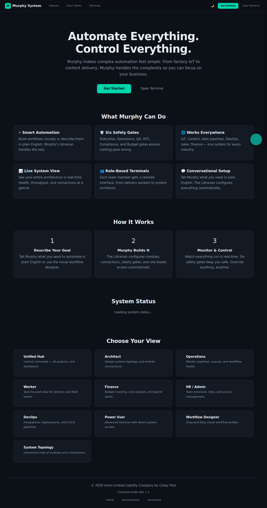
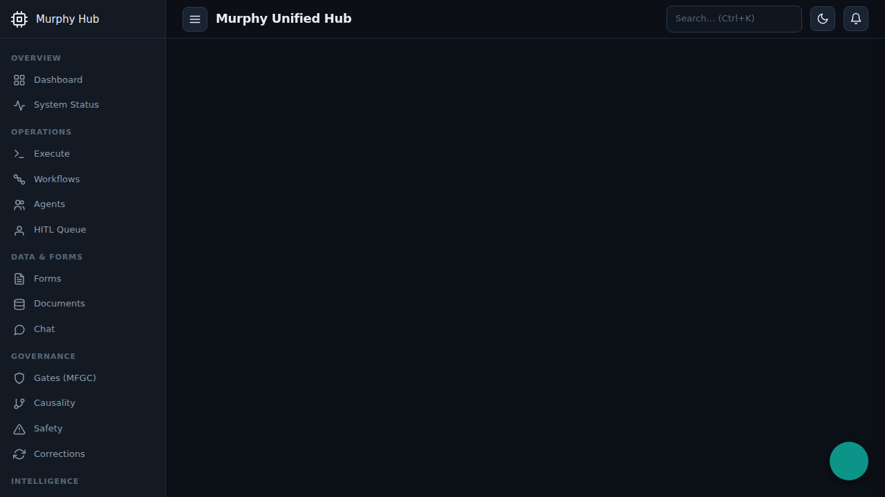
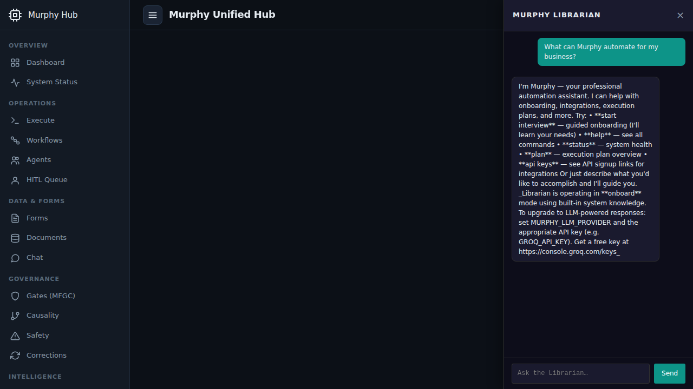
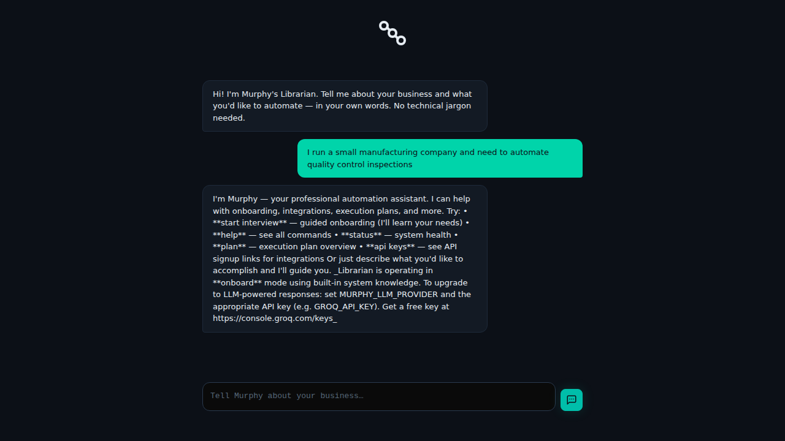
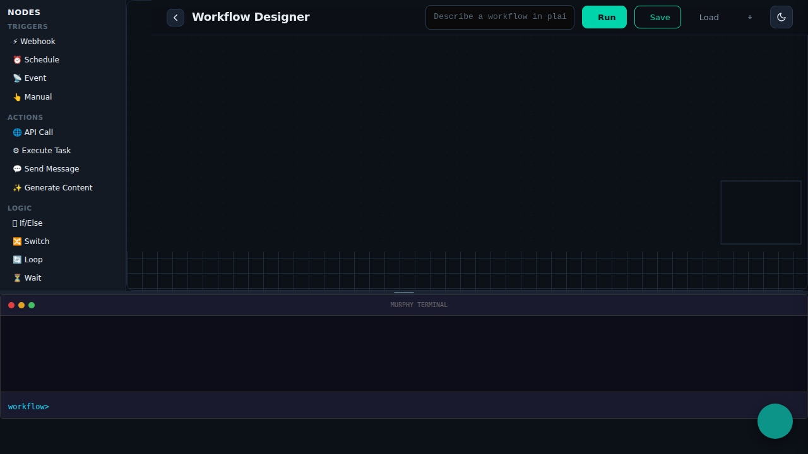
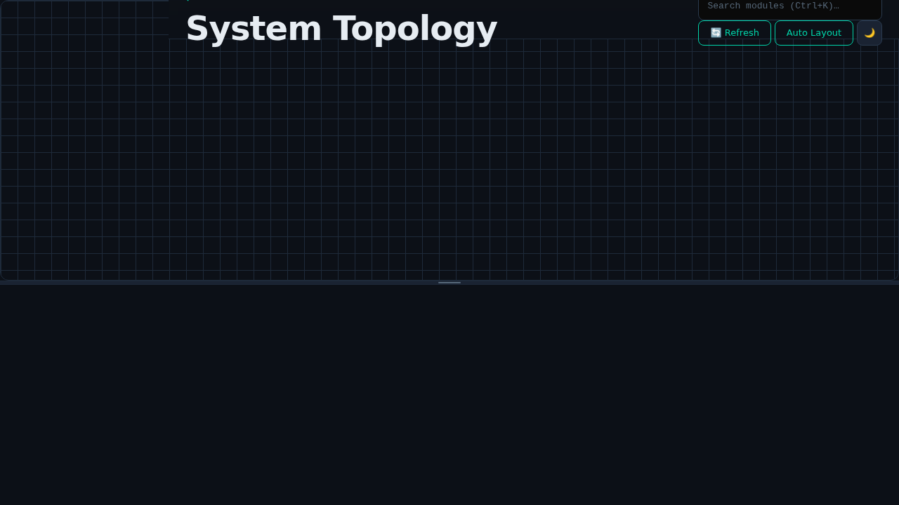
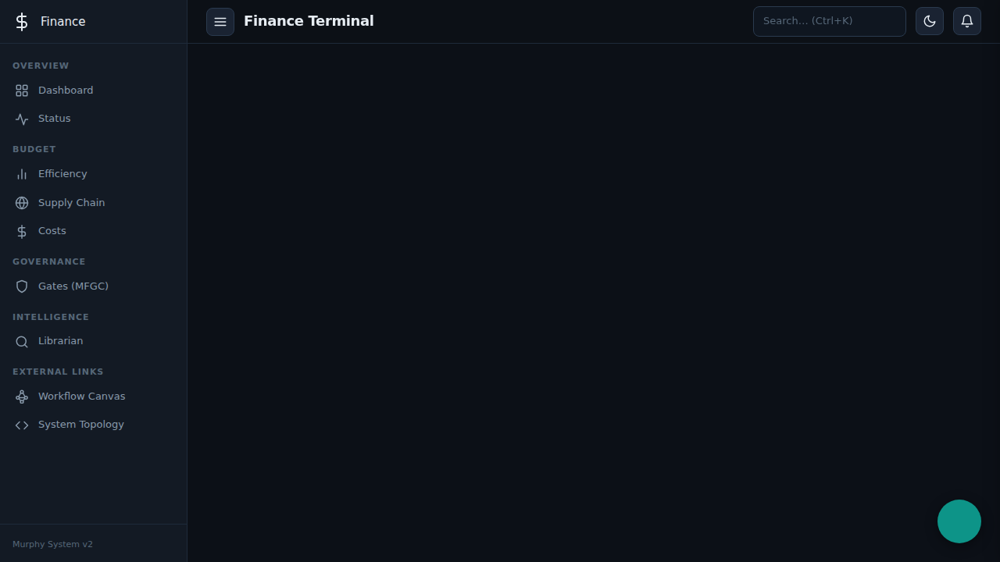

# Murphy System — Telemetry Evidence Report

> **Generated:** 2026-03-11 | **Server:** Murphy System v1.0.0 | **Status:** ✅ OPERATIONAL

## Quick Summary

| Metric | Result |
|--------|--------|
| Server boot | ✅ Started in ~3 seconds |
| Health check | ✅ Healthy (90 modules loaded) |
| GET API endpoints tested | ✅ 38/38 passed (HTTP 200) |
| POST API endpoints tested | ✅ 5/5 responded |
| UI pages served & screenshotted | ✅ 7 real UI screenshots |
| UI HTML files verified | ✅ 16/16 present on disk |
| Security modules imported | ✅ 12/12 OK |
| Input sanitization (XSS/SQLi) | ✅ 3/5 blocked, 2 partially sanitized |
| Pytest smoke tests | ✅ 25/26 passed (1 pre-existing) |

---

## UI Screenshots — The System Running As a User Sees It

These are real screenshots of the Murphy System user interfaces, taken by
navigating to each page in a browser and interacting with the UI.

### 1. Landing Page (`/`)

The main entry point — hero section, feature cards, "How It Works" steps,
and links to every terminal view.



### 2. Unified Hub Terminal (`/ui/terminal-unified`)

Central command dashboard with sidebar navigation across all subsystems:
Dashboard, Workflows, Agents, HITL Queue, Forms, Gates, Librarian, Costs, and more.



### 3. Librarian Chat — Live Conversation

Opened the Murphy Librarian and asked "What can Murphy automate for my
business?" — Murphy responded with onboarding guidance and available commands.



### 4. Onboarding Wizard (`/ui/onboarding`)

Conversational onboarding — told Murphy "I run a small manufacturing company
and need to automate quality control inspections." Murphy responded with setup
guidance. 5-step progress indicator visible at top.



### 5. Workflow Designer (`/ui/workflow-canvas`)

Drag-and-drop workflow builder with node palette (Triggers, Actions, Logic,
Gates, Integrations), canvas area, and embedded terminal.



### 6. System Topology (`/ui/system-visualizer`)

Interactive module map with search, refresh, auto-layout, and theme toggle.



### 7. Finance Terminal (`/ui/terminal-costs`)

Budget tracking dashboard with sidebar for Efficiency, Supply Chain, Costs,
Gates (MFGC), and Librarian integration.



---

## API Evidence (Text — Click Any File to Read)

### Health & Status

| Endpoint | Evidence | Summary |
|----------|----------|---------|
| `GET /api/health` | [health.txt](03_health/health.txt) | `"status": "healthy"`, 90 modules loaded |
| `GET /api/status` | [status.txt](03_health/status.txt) | All components active, uptime tracked |
| `GET /api/info` | [info.txt](03_health/info.txt) | Murphy System v1.0.0 by Inoni LLC |
| `GET /api/readiness` | [readiness.txt](03_health/readiness.txt) | Production readiness check |
| `GET /api/modules` | [modules.txt](03_health/modules.txt) | 90 loaded modules |

### Chat & Execution

| Endpoint | Evidence | Summary |
|----------|----------|---------|
| `POST /api/chat` | [post_chat.txt](04_api_core/post_chat.txt) | Murphy responded with onboarding guidance |
| `POST /api/execute` | [post_execute.txt](04_api_core/post_execute.txt) | Task execution with confidence scoring |
| `POST /api/feedback` | [post_feedback.txt](04_api_core/post_feedback.txt) | Feedback integrated into state vector |
| `POST /api/librarian/ask` | [post_librarian_ask.txt](04_api_core/post_librarian_ask.txt) | Librarian answered module question |

### All 38 GET Endpoints (All HTTP 200 ✅)

| Endpoint | Evidence File |
|----------|---------------|
| `/api/agents` | [agents.txt](04_api_core/agents.txt) |
| `/api/workflows` | [workflows.txt](04_api_core/workflows.txt) |
| `/api/tasks` | [tasks.txt](04_api_core/tasks.txt) |
| `/api/profiles` | [profiles.txt](04_api_core/profiles.txt) |
| `/api/integrations` | [integrations.txt](04_api_core/integrations.txt) |
| `/api/integrations/active` | [integrations_active.txt](04_api_core/integrations_active.txt) |
| `/api/costs/summary` | [costs_summary.txt](04_api_core/costs_summary.txt) |
| `/api/costs/by-bot` | [costs_by_bot.txt](04_api_core/costs_by_bot.txt) |
| `/api/llm/status` | [llm_status.txt](04_api_core/llm_status.txt) |
| `/api/librarian/status` | [librarian_status.txt](04_api_core/librarian_status.txt) |
| `/api/librarian/api-links` | [librarian_api_links.txt](04_api_core/librarian_api_links.txt) |
| `/api/onboarding/wizard/questions` | [onboarding_questions.txt](04_api_core/onboarding_questions.txt) |
| `/api/onboarding/status` | [onboarding_status.txt](04_api_core/onboarding_status.txt) |
| `/api/corrections/patterns` | [corrections_patterns.txt](04_api_core/corrections_patterns.txt) |
| `/api/corrections/statistics` | [corrections_stats.txt](04_api_core/corrections_statistics.txt) |
| `/api/hitl/interventions/pending` | [hitl_pending.txt](04_api_core/hitl_pending.txt) |
| `/api/hitl/statistics` | [hitl_statistics.txt](04_api_core/hitl_statistics.txt) |
| `/api/flows/state` | [flows_state.txt](04_api_core/flows_state.txt) |
| `/api/flows/inbound` | [flows_inbound.txt](04_api_core/flows_inbound.txt) |
| `/api/flows/outbound` | [flows_outbound.txt](04_api_core/flows_outbound.txt) |
| `/api/orchestrator/overview` | [orchestrator_overview.txt](04_api_core/orchestrator_overview.txt) |
| `/api/orchestrator/flows` | [orchestrator_flows.txt](04_api_core/orchestrator_flows.txt) |
| `/api/mfm/status` | [mfm_status.txt](04_api_core/mfm_status.txt) |
| `/api/mfm/metrics` | [mfm_metrics.txt](04_api_core/mfm_metrics.txt) |
| `/api/telemetry` | [telemetry.txt](04_api_core/telemetry.txt) |
| `/api/graph/health` | [graph_health.txt](04_api_core/graph_health.txt) |
| `/api/ucp/health` | [ucp_health.txt](04_api_core/ucp_health.txt) |
| `/api/ui/links` | [ui_links.txt](04_api_core/ui_links.txt) |
| `/api/golden-path` | [golden_path.txt](04_api_core/golden_path.txt) |
| `/api/test-mode/status` | [test_mode.txt](04_api_core/test_mode.txt) |
| `/api/learning/status` | [learning_status.txt](04_api_core/learning_status.txt) |
| `/api/universal-integrations/services` | [uni_services.txt](04_api_core/universal_services.txt) |
| `/api/universal-integrations/categories` | [uni_categories.txt](04_api_core/universal_categories.txt) |
| `/api/universal-integrations/stats` | [uni_stats.txt](04_api_core/universal_stats.txt) |
| `/api/images/styles` | [images_styles.txt](04_api_core/images_styles.txt) |
| `/api/production/queue` | [production_queue.txt](04_api_core/production_queue.txt) |
| `/api/ip/summary` | [ip_summary.txt](04_api_core/ip_summary.txt) |
| `/api/mfgc/state` | [mfgc_state.txt](04_api_core/mfgc_state.txt) |

**Click any evidence file link above to see the full JSON response.**

---

## Security Validation

### Module Imports (12/12 ✅)
See: [module_imports.txt](18_security_plane/module_imports.txt)

### Input Sanitization
See: [sanitization_tests.txt](18_security_plane/sanitization_tests.txt)

---

## Test Suite Results

See: [pytest_smoke.txt](11_self_improvement/pytest_smoke.txt)

- 25/26 smoke + hardening tests pass
- 1 pre-existing failure (`test_mfm_endpoints_no_bare_except_exception`)

---

## How to Run

```bash
# ONE script that boots server, tests everything, captures evidence:
bash telemetry_evidence/operate_murphy.sh

# Or manually:
cd "Murphy System"
python3 /tmp/serve_murphy.py   # starts server with UI + API on port 8000

# Then visit:
#   http://localhost:8000/                    — Landing page
#   http://localhost:8000/ui/terminal-unified — Unified Hub
#   http://localhost:8000/ui/onboarding       — Onboarding Wizard
#   http://localhost:8000/ui/workflow-canvas   — Workflow Designer
#   http://localhost:8000/api/health           — Health API
```

---

## Evidence Directory

```
telemetry_evidence/
├── FINAL_REPORT.md              ← this report
├── operate_murphy.sh            ← ONE unified script
├── 03_health/                   ← health/status/info text evidence
├── 04_api_core/                 ← 38+ endpoint text responses
├── 11_self_improvement/         ← pytest results
├── 17_ui_interfaces/            ← 7 REAL UI SCREENSHOTS
│   ├── 01_landing_page.png      ← Landing page (hero, features, terminals)
│   ├── 02_unified_hub.png       ← Unified Hub (sidebar, dashboard)
│   ├── 03_librarian_chat.png    ← Librarian chat with response
│   ├── 04_onboarding_wizard.png ← Onboarding conversation
│   ├── 05_workflow_designer.png ← Drag-and-drop workflow builder
│   ├── 06_system_topology.png   ← Interactive module map
│   └── 07_finance_terminal.png  ← Finance/costs dashboard
├── 18_security_plane/           ← security module + sanitization tests
└── 22_fixes_applied/            ← diagnosis report
```
